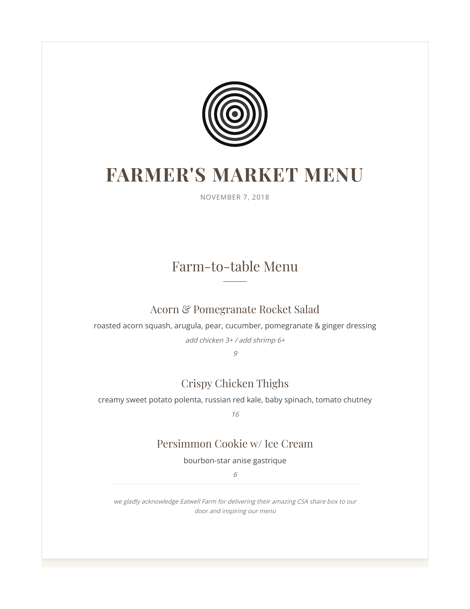

# oshea - Markdown to PDF Converter

A [Node.js](https://nodejs.org/) command-line tool that transforms [Markdown](https://daringfireball.net/projects/markdown/) files into beautifully styled PDFs.

It features a powerful, extensible plugin system, making it incredibly versatile for creating anything from CVs and cover letters to recipe books and custom reports. Built on [markdown-it](https://github.com/markdown-it/markdown-it) for Markdown parsing and [puppeteer](https://pptr.dev/) for PDF generation.

---

> [!TIP]
> The rise of AI tooling has brought enormous growth to universal Markdown usage. **oshea** is ideal for anyone who writes in Markdown but needs polished, professional, reproducible output for resumes, reports, presentations, and more.
> 
> See [Creating Plugins with Claude Skills](#creating-plugins-with-claude-skills) for building plugins with Claude or Codex.


## Quick Start

Convert a basic Markdown file to PDF
```bash
oshea my-document.md
```
Use a built-in plugin for styling
```bash
oshea my-resume.md --plugin cv
```
Create a cover letter with professional formatting
```bash
oshea my-letter.md --plugin cover-letter
```

## Gallery

<table>
  <tr>
    <td><a href="plugins/cv">
      
      <br><strong>CV Layout</strong></a>
    </td>
    <td><a href="plugins/cover-letter">
      
      <br><strong>Cover Letter Layout</strong></a>
    </td>
    <td><a href="plugins/recipe">
      
      <br><strong>Recipe Layout</strong></a>
    </td>
  </tr>
</table>
<table>
  <tr>
    <td><a href="plugins/advanced-card">
      
      <br><strong>Business Card</strong></a>
    </td>
    <td><a href="https://github.com/brege/restaurant-menu">
      
      <br><strong>Restaurant Menu</strong></a>
    </td>
    <td><a href="https://github.com/brege/d3-histogram-slide">
      
      <br><strong>D3.js Slide</strong></a>
    </td>
  </tr>
</table>


## Installation
```bash
git clone https://github.com/brege/oshea.git
cd oshea
npm install -g
```

## Documentation
- [**Docs**](docs/README.md) for the main documentation index
  - [Guides](docs/guides)
  - [Walkthroughs](docs/walkthroughs)
  - [References](docs/refs)
  - [Historical](docs/archive)
- [**Paths**](paths/README.md) registry README used by all app and test modules
- [**Plugins**](plugins/README.md) bundled in the app and how to use and build them
- [**Scripts**](scripts/README.md) for an index of maintainer scripts
- [**Tests**](test/README.md) for integration, end-to-end, and life-cycle tests with [Mocha](https://mochajs.org/)

## Working with Plugins

Use any plugin with your markdown files:
```bash
oshea convert my-resume.md --plugin cv
```

Take a look at the [Bundled Plugins](plugins/README.md) page for more examples.

### Watch mode

**oshea** can watch for changes to your markdown and plugin files with `oshea --watch`.

> [!TIP]
> The `convert` command is implicit when a markdown file is provided. For generators (like building recipe books), the distinction between `convert` and `generate` becomes important.

### Creating Custom Plugins

To customize layouts, you can archetype from existing plugins or create a new one from scratch.
```bash
oshea plugin create --from cover-letter my-better-letter --target-dir 'my-plugins'
```

### Plugin structure
```
my-plugins/my-better-letter
├── .contract                       schema and in-situ testing
├── my-better-letter.config.yaml    plugin configuration (page size, versioning, etc)
├── my-better-letter.css            custom CSS properties
├── my-better-letter-example.md     example file
├── index.js                        handler
└── README.md                       plugin description (embedded --help text)
```

Plugins are portable and can be shared across projects. See [Bundled Plugins](plugins/README.md) index for more information.

### Creating Plugins with Claude and Codex Skills

Use the skill-first workflow documented in the [**Claude Skills Guide**](docs/guides/claude-skills.md). The technical contract that agents compose plugins from is in: [Plugin Contract](docs/refs/plugin-contract.md), [AI Interaction Specification](docs/refs/interaction-spec.md), and [Archetyping Walkthrough](docs/walkthroughs/archetyping-a-plugin.md).

Iterate with your agent on the plugin until your document is satisfactory. As of February 2026, this process takes about 5 minutes.

## Usage & Commands

### Cheat Sheet

See [Cheat Sheet](docs/refs/cheat-sheet.md) for many, many examples.

### Tab-completion
```bash
echo 'source <(oshea completion)' >> ~/.bashrc
source ~/.bashrc
```

### Managing Plugins
```bash
oshea plugin help cv              # plugin-specific help
oshea plugin list                 # list all plugins (add --short for brief)
oshea plugin validate my-plugin   # validate plugin structure and tests
```

### Installing Plugins
Install a local plugin
```bash
oshea plugin add ./my-plugin
```
Install a plugin from GitHub
```bash
oshea plugin add https://github.com/user/my-plugin
```

See the [Plugins Index](plugins/README.md) for more information. There is also an index of known external plugins at [github.com/brege/oshea-plugins](https://github.com/brege/oshea-plugins).

## Testing

This project has a rich testing framework based on its [`.mocharc.js`](.mocharc.js). In addition to the in-situ tests bundled with each plugin, there are over 300 tests, ranging from unit, integration, end-to-end, and lifecycle tests, in a declarative, manifest-driven harness and factory mocking system.

See the [Test Index](test/README.md) for all test suite documentation.

---

## License

[MIT License](LICENSE)
