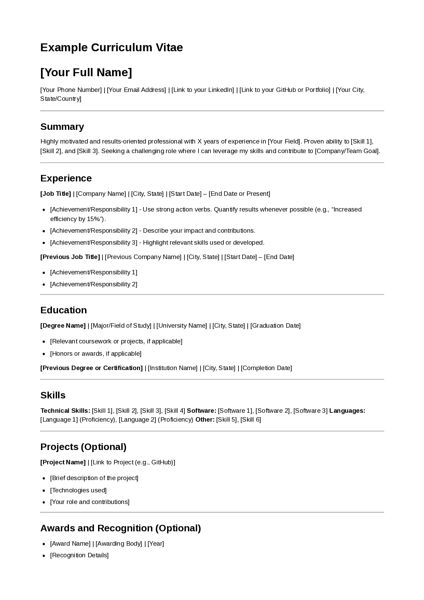
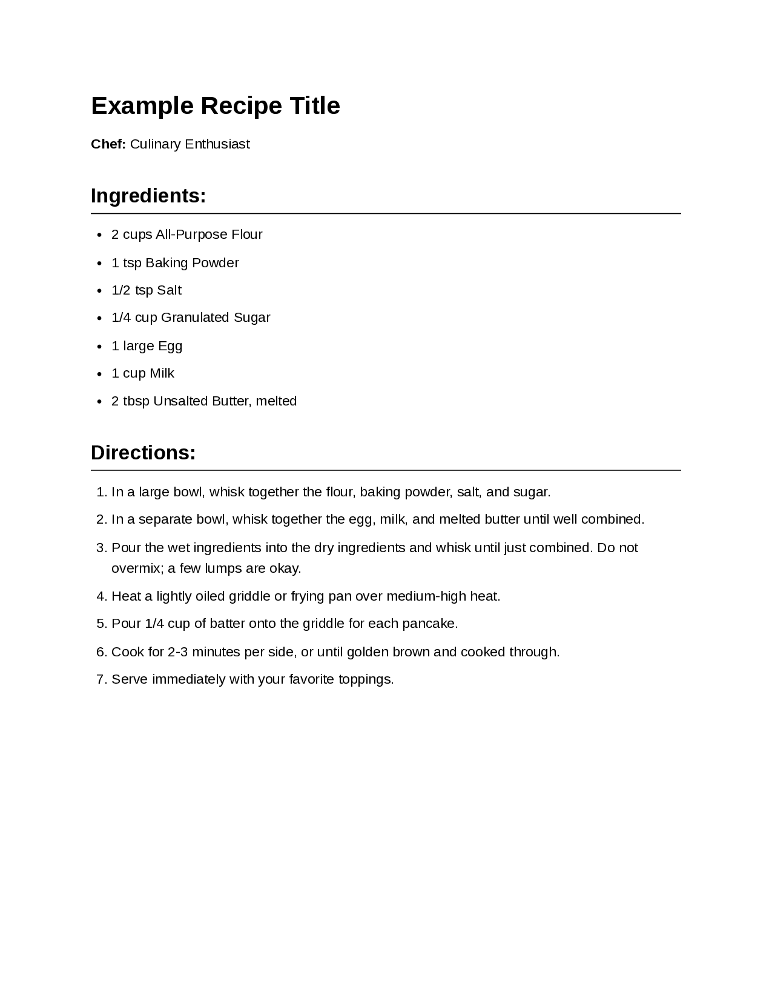

# md-to-pdf: Markdown to PDF Converter 

A Node.js command-line tool that converts Markdown files into styled PDFs. It uses an extensible document type plugin system, making it suitable for CVs, cover letters, recipes, recipe books, and batch exporting Hugo content. The tool uses `markdown-it` for Markdown parsing and Puppeteer (headless Chromium) for PDF generation.

## Features

* **Extensible Plugin System**: Define new document types with custom processing, configurations (local `*.config.yaml`), CSS, and handler scripts. Plugins can be bundled with the tool, reside in your user-level XDG configuration directory, or be project-specific. Existing types are implemented as **plugins**:
  
  - [`default`](plugins/default)
  - [`cv`](plugins/cv)
  - [`cover-letter`](plugins/cover-letter)
  - [`recipe`](plugins/recipe)
  - [`recipe-book`](plugins/recipe-book)

  And a batch export **extension**:

  - [`hugo-export-each`](plugins/hugo-export-each) -- This is a command, not a plugin type itself, but uses a base plugin for styling.

* **Versatility**
  * **Singletons**: Convert single Markdown files to PDF using type-specific plugins.
  * **Collections**: Generate combined PDF recipe books with optional covers and tables of contents.
  * **Batch Export**: Batch export individual PDFs from Hugo content directories with specific naming and styling.

* **Configurability**
  * A main `config.yaml` for global settings and **plugin registration**.
  * Each plugin manages its own local configuration for PDF options, CSS, and behavior, which can be overridden.
  * YAML front matter in Markdown files for metadata and dynamic content substitution.
  * A `--config` flag for project-specific settings, allowing manifestation of stylistic profiles and registration of project-local plugins.
  * User-level (XDG) configuration for global defaults and registration of user-specific plugins.

* **Watch Mode**
  * Use the `--watch` flag with `convert` and `generate` commands to automatically re-generate PDFs when source Markdown, plugin configurations, or plugin CSS files are modified.

* **LaTeX Math Rendering**: Displays mathematical notation using KaTeX. Inline math is supported with `$...$` and display math with `$$...$$`. Other common LaTeX delimiters like `\(...\)` and `\[...\]` are not currently supported. See [`config.example.yaml`](config.example.yaml) for an example.

### Examples

| [CV Layout](plugins/cv)                                       | [Cover Letter Layout](plugins/cover-letter)                           | [Recipe Layout](plugins/recipe)                        |
| :-----------------------------------: | :----------------------------------: | :---------------------------------: |
|  |  |  |


## Prerequisites

* **Node.js:** Version 18.0.0 or higher is recommended. Download from [nodejs.org](https://nodejs.org/).
* **npm (Node Package Manager):** Usually included with Node.js.

## Installation

1.  **Clone the repository:**
    ```bash
    git clone https://github.com/brege/md-to-pdf.git
    cd md-to-pdf
    ```

2.  **Install dependencies:**
    
    ```bash
    npm install
    ```
    This installs required packages and downloads a standalone version of Chromium (for [Puppeteer](https://pptr.dev/) to render intermediate HTML to PDF), and [Chokidar](https://github.com/paulmillr/chokidar) for auto-refreshing your PDF viewer.

3.  **Initialize Configuration (Optional but Recommended):**
    If you intend to customize global settings or add your own user-level plugins, you can copy the example configuration:
    ```bash
    cp config.example.yaml config.yaml
    ```
    This bundled `config.yaml` primarily handles registration of built-in plugins and can be used for global tool settings (like `pdf_viewer`). You can also set up user-level configurations (see "Configuration Lookup Order" and "Creating and Using Custom Plugins").

4.  **(Optional) Make the CLI globally available:**
    To run `md-to-pdf` from any directory:
    ```bash
    npm link
    ```
    (You might need `sudo` depending on your npm setup. Alternatively, run from the project root using `node ./cli.js ...`.)

## Usage

The primary interface is [`cli.js`](cli.js). If globally linked, use `md-to-pdf`. Otherwise, from the project root, use `node ./cli.js`.

**Global Options:**

* `--config <path_to_config.yaml>`: Specify a custom path to your main project-specific YAML configuration file. This file can register project-local plugins and override settings.
* `--factory-defaults` (or `--fd`): Use only bundled default configurations and plugins, ignoring user (XDG) and project (`--config`) configurations. Useful for debugging or getting a "vanilla" output.

### Commands

There are three main command types:

  - **Type 1 -- Singletons**: Converting single Markdown files to PDFs.
  
  - **Type 2 -- Collections**: Generate combined PDF (recipe books) from multiple Markdown files, supporting covers and tables of contents.
  
  - **Type 3 -- Batch Export**: Batch export individual PDFs from Hugo content directories.

### Type 1 -- Singletons: `convert <markdownFile> --plugin <pluginName>`

  Converts a single Markdown file to PDF using the specified document type plugin.

  **Syntax:**
  ```bash
  md-to-pdf convert <markdownFile> --plugin <pluginName> [options]
```

**Arguments & Options:**

```text
<markdownFile>                  Required, Path to the input Markdown file
-p, --plugin <pluginName>       Required, but defaults to 'default' if not specified
-o, --outdir <directory>        Output directory for the PDF. Defaults to the input file's directory.
-f, --filename <name.pdf>       Specify the exact output PDF filename
--no-open                       Prevents automatically opening the generated PDF. 
                                  (Default open behavior depends on main config's pdf_viewer setting)
-w, --watch                     Enable watch mode to automatically rebuild on file changes.
```

**Examples:**

  * Convert a CV using the [`cv`](plugins/cv) plugin and watch for changes:

    ```bash
    md-to-pdf convert examples/example-cv.md --plugin cv --watch
    ```

  * Convert a recipe, specifying output:

    ```bash
    md-to-pdf convert examples/example-recipe.md \
        --plugin recipe \
        --outdir ./output_pdfs \
        --filename my-dish.pdf
    ```

### Type 2 -- Collections: `generate <pluginName> [plugin-specific-options...]`

Generates a document using a specified plugin. This command is suitable for plugins that might not take a single Markdown file as primary input (like [`recipe-book`](plugins/recipe-book)) or require more complex arguments.

**Syntax:**

```bash
md-to-pdf generate <pluginName> \
    [options_for_the_plugin...] \
    --outdir <directory> \
    --filename <name.pdf>
```

**Arguments & Options:**

```text
<pluginName>                    Required, Name of the plugin to use
[plugin-specific-options...]    Additional options required by the specific plugin (e.g., --recipes-base-dir for recipe-book)
-o, --outdir <directory>        Output directory. Defaults to the current directory.
-f, --filename <name.pdf>       Specific output PDF name.
--no-open                       Prevents auto-opening.
-w, --watch                     Enable watch mode.
```

**Example (Recipe Book):**
The `recipe-book` plugin is invoked using the `generate` command:

```bash
md-to-pdf generate recipe-book \
  --recipes-base-dir examples/hugo-example \
  --outdir ./my_cookbooks \
  --filename "Family Cookbook.pdf" \
  --watch
```

### Type 3 -- Batch Export: `hugo-export-each <sourceDir> --base-plugin <pluginName>`

Batch exports individual PDFs from a Hugo content directory. Each item is processed using the specified base plugin for styling. PDFs are saved alongside their source Markdown files. *(Watch mode is not currently supported for this command).*

**Syntax:**

```bash
md-to-pdf hugo-export-each <sourceDir> --base-plugin <pluginName> [options]
```

**Arguments & Options:**

```text
<sourceDir>                   Required, Path to the source directory containing Hugo content items
--base-plugin <pluginName>    Required, defaults to `recipe` or as configured in the main config file used for the command.
--hugo-ruleset <rulesetName>  The key in the main config file's `hugo_export_each` section for specific processing rules (e.g., 'default_rules').
--no-open                     Prevents auto-opening (default behavior for this command).
```

**Example:**

```bash
md-to-pdf hugo-export-each examples/hugo-example --base-plugin recipe
```

## Configuration

`md-to-pdf` uses a layered configuration system. This allows you to set global defaults and then override them for your specific user needs (via XDG configuration) or for individual projects (via a project-specific configuration file passed with `--config`).

This section focuses on how to customize **global settings** (like `pdf_viewer`) and the **settings of existing plugins** (like changing CSS or PDF options for the bundled `cv` or `recipe` plugins). For details on creating entirely new plugins and how they are discovered, see the "[Creating and Using Custom Plugins](creating-and-using-custom-plugins)" section.

### Configuration Layers and Precedence

Settings are resolved by looking through up to three layers, with later layers overriding earlier ones:

1.  **Bundled Defaults (Lowest - Factory Settings):**

    If you installed this repository in `~/md-to-pdf/`:

    * **Main Config:** The `~/md-to-pdf/config.yaml` file (at the root of the `md-to-pdf` installation). This file defines default global settings (like `global_pdf_options`) and registers the paths to the standard bundled plugins (e.g., [`cv`](plugins/cv/), [`recipe`](plugins/recipe/) through its `document_type_plugins` section.

    * **Plugin Defaults:** Each bundled plugin ([`plugins/cv/`](plugins/cv) has its own `<pluginName>.config.yaml` ([`cv.config.yaml`](plugins/cv/cv.config.yaml) that defines its default behavior, CSS files, and PDF options.

    Unless you want to maintain a fork of this repository, it is best to use the following methods to edit stylesheets and plugin behavior.

2.  **XDG User Defaults (Optional - Personal Settings):**

    The typical location is `~/.config/md-to-pdf/` on Linux. You should configure personal global defaults here or customize any plugin's behavior for all your projects.
      
    * **Global User Settings:** Create `~/.config/md-to-pdf/config.yaml` to override tool-wide settings like `pdf_viewer` or `global_pdf_options`.

        ```yaml
        # ~/.config/md-to-pdf/config.yaml
        pdf_viewer: "evince" 
        global_pdf_options:
          format: "A4"                              # Your preferred default paper size
        ```
      
    * **Plugin-Specific User Overrides:** To override settings for a specific plugin (e.g., the bundled `cv` plugin), create a directory and file like `~/.config/md-to-pdf/cv/cv.config.yaml`.
        
        ```yaml
        # ~/.config/md-to-pdf/cv/cv.config.yaml
        # Overrides for the 'cv' plugin (e.g., to change its default CSS or margins)
        description: "My custom default CV style."
        css_files: ["./my_personal_cv_style.css"]   # Path relative to this file
        inherit_css: false                          # Use only my CSS
        pdf_options:
          margin: { top: "0.8in", bottom: "0.8in" }
        ```
        Place `my_personal_cv_style.css` in `~/.config/md-to-pdf/cv/`.
      
    This XDG **`~/.config/md-to-pdf/config.yaml`** can also be used to register your own custom plugins. See "[Creating and Using Custom Plugins](creating-and-using-custom-plugins)".

3.  **Project-Specific Configuration (Highest - Project Settings):**

    Use the `--config /path/to/your_project_main.yaml` CLI flag.
  
    * **Project Specific Settings:** The `your_project_main.yaml` file can override any global settings from the Bundled or XDG layers.
      
        ```yaml
        # /path/to/your_project_main.yaml
        pdf_viewer: "firefox"                       # Project-specific viewer
        global_pdf_options:
          format: "Letter" 
        ```

    * **Project Plugin-Specific Overrides:** This `your_project_main.yaml` can also point to other YAML files within your project that provide further overrides for specific plugins.

        ```yaml
        # /path/to/your_project_main.yaml (continued)
        # This 'document_type_plugins' section here can EITHER register new project-local
        #  plugins
        # OR 
        #  point to files that override settings for existing (bundled/XDG) plugins.
        document_type_plugins:
          cv: "./project_cv_overrides.config.yaml"  # Path relative to your_project_main.yaml
        recipe: "./my_project_recipe_style.config.yaml"
        ```
     
    Then, `./project_cv_overrides.config.yaml` would contain only the settings you want to change for the `cv` plugin within this project:
    
      ```yaml
      # ./project_cv_overrides.config.yaml
      description: "CV settings for My Special Project"
      css_files: ["./project_specific_cv.css"]      # Path relative to this override file
      pdf_options:
        format: "Legal"
      ```

    The project's main config file (from `--config`) is also the place to register project-local custom plugins. See "[Creating and Using Custom Plugins](creating-and-using-custom-plugins)".

#### Overriding Plugin Settings

To change how a specific plugin like `cv` looks or behaves, you can create a `cv.config.yaml` in your XDG folder (`~/.config/md-to-pdf/cv/`) for user-wide changes, or point to a project-specific override file from your project's main config (used with `--config`) for project-only changes.

#### CSS Merging with `inherit_css`

When `css_files` are specified in an override layer (XDG or Project plugin-specific):

  * `inherit_css: true` (boolean): Appends the CSS files from the current layer to those from lower layers.
  * `inherit_css: false` (boolean, default if not specified): Replaces all CSS files from lower layers with only those from the current layer.

### Front Matter and Placeholders

Markdown files can include YAML front matter for metadata and to enable dynamic content substitution.

**Example Front Matter:**

```yaml
---
title: "My Document Title"
author: "Author Name"
date: "{{ .CurrentDateISO }}" # Uses a dynamic date placeholder
custom_data:
  key: "Some value"
---

Content with {{ .custom_data.key }} and today's date: {{ .CurrentDateFormatted }}.
```

**Dynamic Placeholders:**

  * **Syntax:** `{{ .key }}` or `{{ .path.to.key }}` (e.g., `{{ .custom_data.key }}`). The `.` refers to the root of the data context (processed front matter).

  * **Automatic Date Placeholders:**

      * `{{ .CurrentDateFormatted }}`: Current date, long format (e.g., "May 19, 2025").
      * `{{ .CurrentDateISO }}`: Current date, `YYYY-MM-DD` format.


## Creating and Using Custom Plugins

You can extend `md-to-pdf` by creating your own plugins. This allows you to define custom document structures, processing logic, styling, and PDF options. This section explains how to create a plugin and make it known to `md-to-pdf`.

**1. Plugin Directory Structure:**

Create a directory for your plugin. This directory can be located anywhere, for example:

  * `my_project/custom_plugins/my_plugin/` (for a plugin specific to one project)
  * `~/.config/md-to-pdf/shared_plugins/my_plugin/` (for a plugin you want to use across projects)

A typical plugin directory (e.g., for a plugin named `business-card`) contains:

```
my_plugins/
└── business-card/                # Your plugin's main directory
    ├── business-card.config.yaml # Primary configuration for this plugin
    ├── index.js                  # The Node.js handler script
    └── business-card.css         # CSS file(s) for styling
```

**2. Essential Plugin Files:**

  * **`<pluginName>.config.yaml` (e.g., `business-card.config.yaml`):**
    This is your plugin's manifest. It must define:

      * `handler_script`: Path to your plugin's Node.js handler module (e.g., `"index.js"`), relative to *this config file*.
      
      * It should also typically define `description`, `css_files` (relative to this file), and `pdf_options`.
    
    *Example `business-card.config.yaml`*:


    ```yaml
    # my_plugins/business-card/business-card.config.yaml
    description: "A simple business card plugin."
    handler_script: "index.js"
    css_files: ["business-card.css"]
    pdf_options:
      width: "3.5in"
      height: "2in"
      margin: { top: "0.1in", bottom: "0.1in", left: "0.1in", right: "0.1in" }
      printBackground: true
    inject_fm_title_as_h1: false
    ```

  * **Handler Script (e.g., `index.js`):**

    A Node.js module exporting a class or object with an async `generate` method. See bundled plugins like `plugins/default/index.js` for an example using `DefaultHandler`, or `plugins/recipe-book/index.js` for a custom handler.

  * **CSS File(s) (e.g., `business-card.css`):** Standard CSS.

**3. Registering Your Custom Plugin:**
For `md-to-pdf` to find and use your plugin, you must register it by adding an entry to the `document_type_plugins` section of a main configuration file:

  * **For User-Global Custom Plugins (XDG):**
    
    Edit or create `~/.config/md-to-pdf/config.yaml`:

    ```yaml
    # ~/.config/md-to-pdf/config.yaml
    document_type_plugins:
      # plugin-cli-name: "/absolute/path/to/my_plugins/pluginName/pluginName.config.yaml"
      business-card: "~/.config/md-to-pdf/plugins/business-card/business-card.config.yaml"
    ```

  * **For Project-Specific Custom Plugins:**
  
    In your project's main configuration file (e.g., `my_project_config.yaml`, used with `--config`):

    ```yaml
    # my_project_config.yaml
    document_type_plugins:
      # plugin-cli-name: "./relative/path/relative/to/this/file/pluginName/pluginName.config.yaml"
      business-card: "./my_plugins/business-card/business-card.config.yaml"
    ```

    The path to your plugin's `<pluginName>.config.yaml` is resolved relative to the main project config file it's listed in--the one that you line with `--config ...`--or, more strictly, can be an absolute path.

**4. Using Your Plugin:**
Once registered, use the `plugin-cli-name` you defined:

```bash
md-to-pdf convert path/to/data.md --plugin business-card [--config your_project_config.yaml]
# (Add --config your_project_config.yaml if it's registered there)
```

The system uses a hierarchy (*Project* \> *XDG* \> *Bundled*) to decide which registration to use if multiple main configs define a plugin with the same `plugin-cli-name`. The settings within your plugin's `<pliginName>.config.yaml` can still be overridden via the XDG or Project layers as described in the main ["Configuration"](#configuration) section if needed, though this may be less common for custom plugins which usually define their primary behavior in their own config files.

## Testing

The project includes an integration test suite.

```bash
npm test
```

Test scripts and configurations are in [`test/`](test/), and [`test/config.test.yaml`](test/config.test.yaml), which should reflect the plugin structure.

For more details, see [`test/README.md`](test%23readme).

## License

This project is licensed under the [MIT License](LICENSE).


