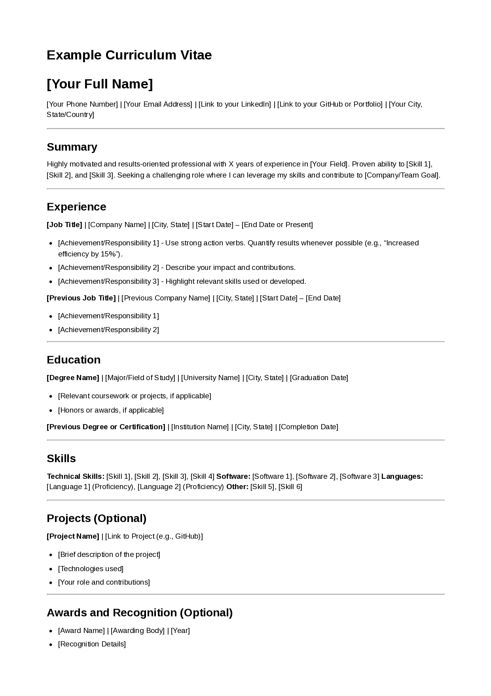
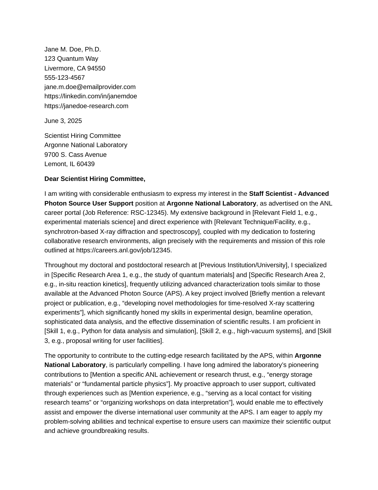
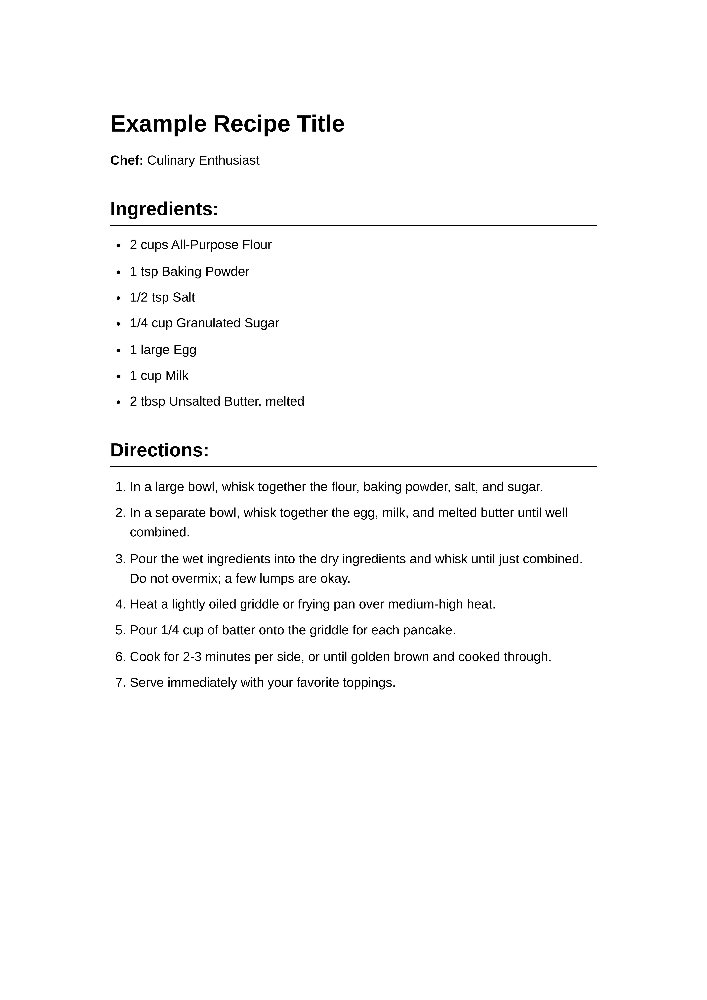

# md-to-pdf - Markdown to PDF Converter 

A [Node.js](https://nodejs.org/) command-line tool that converts [Markdown](https://daringfireball.net/projects/markdown/) files into styled PDFs. It uses an extensible document type plugin system, making it suitable for CVs, cover letters, recipes, recipe books, or anything else in your printable stack. Built on top of:

  - [`markdown-it`](https://github.com/markdown-it/markdown-it) for Markdown parsing, and
  - [Puppeteer](https://pptr.dev/) for PDF generation.

### Documentation

#### Table of Contents

  - [Installation](#installation)
  - [Usage](#usage)
  - [Commands](#commands-overview)
  - [Configuration](#configuration)

#### Reference Guides

  - [Cheat Sheet](docs/cheat-sheet.md) - a quick reference guide
  - [Plugin Development Guide](docs/plugin-development.md) - how to manage and create new plugins
  - [Batch Processing Guide](docs/batch-processing-guide.md) - how to process multiple files using external scripts
  - [Project Roadmap](docs/roadmap.md) - changelog and the future of `md-to-pdf`

#### What it's like to use

**Resume**
```bash
md-to-pdf convert resume.md --plugin cv
````

**Cover Letter**

```bash
md-to-pdf convert cover-letter.md --plugin cover-letter
```

## Features

  * **Extensible Plugin System**: Define new document types with custom processing, configurations (local `*.config.yaml`), CSS, and handler scripts. Plugins can be bundled with the tool, reside in your user-level XDG configuration directory, or be project-specific. Existing types are implemented as **plugins**:

    - [`default`](plugins/default)
    - [`cv`](plugins/cv)
    - [`cover-letter`](plugins/cover-letter)
    - [`recipe`](plugins/recipe)
    - [`recipe-book`](plugins/recipe-book)

  * **Versatility**

    * **Singletons**: Convert single Markdown files to PDF using type-specific plugins.
    * **Collections**: Generate combined PDF recipe books with optional covers and tables of contents using plugins like `recipe-book`.
    * **Batch Export**: For processing multiple individual Markdown files (e.g., from Hugo content directories or other collections), `md-to-pdf` encourages the use of external scripts that call the `md-to-pdf convert` command. See the [Batch Processing Guide](docs/batch-processing-guide.md) for examples.

  * **Configurability**

    * Set global options and register plugins in a main `config.yaml`.
    * Control plugin appearance and behavior through a 3-tier configuration system: Bundled Defaults \< XDG User Settings \< Project-Specific Settings (via `--config`).
    * Use YAML front matter within Markdown files for document-specific data and placeholders.
    * *The [Configuration](#configuration) section below explains these features in detail. For creating new plugins, see the [Plugin Development Guide](docs/plugin-development.md).*

  * **Watch Mode**

    * Use the `--watch` flag with `convert` and `generate` commands to automatically re-generate PDFs when source Markdown, plugin configurations, or plugin CSS files are modified.

  * **[LaTeX](https://en.wikipedia.org/wiki/LaTeX) Math Rendering**

    * Displays mathematical notation using [KaTeX](https://katex.org/). Inline math is supported with `$...$` and display math with `$$...$$`. Other common LaTeX delimiters like `\(...\)` and `\[...\]` are not currently supported. See [`config.example.yaml`](config.example.yaml) for an example.

### Examples

| [CV Layout](plugins/cv)                                       | [Cover Letter Layout](plugins/cover-letter)                           | [Recipe Layout](plugins/recipe)                        |
| :-----------------------------------: | :----------------------------------: | :---------------------------------: |
|  |  |  |

## Prerequisites

  * **Node.js:** Version 18.0.0 or higher. See [nodejs.org](https://nodejs.org/).
  * **npm (Node Package Manager):** Usually included with Node.js.

##### Verify Installation
```bash
node -v
npm -v
```

## Installation

1.  **Clone the repository:**

    ```bash
    git clone https://github.com/brege/md-to-pdf.git
    cd md-to-pdf
    ```

2.  **Install dependencies:**

    ```bash
    npm install
    ```

    This installs required packages and downloads a standalone version of Chromium (for [Puppeteer](https://pptr.dev/) to render intermediate HTML to PDF), and [Chokidar](https://github.com/paulmillr/chokidar) for auto-refreshing your PDF viewer.

3.  **Initialize Configuration (Optional but Recommended):**
    If you intend to customize global settings or add your own user-level plugins, you can copy the example configuration:

    ```bash
    cp config.example.yaml config.yaml
    ```

    This bundled `config.yaml` primarily handles registration of built-in plugins and can be used for global tool settings (like `pdf_viewer`). You can also set up user-level configurations (see [Configuration Lookup Order](#configuration-lookup-order) and the [Plugin Development Guide](docs/plugin-development.md).

4.  **(Optional) Make the CLI globally available:**
    To run `md-to-pdf` from any directory:

    ```bash
    npm link
    ```

## Usage

The primary interface is [`cli.js`](cli.js). If globally linked, use `md-to-pdf`. Otherwise, from the project root, use `node ./cli.js`.

**Global Options:**

  * `--config <path_to_config.yaml>`: Specify a custom path to your main project-specific YAML configuration file. This file can register project-local plugins and override settings.
  * `--factory-defaults` (or `--fd`): Use only bundled default configurations and plugins, ignoring user (XDG) and project (`--config`) configurations. Useful for debugging or getting a "vanilla" output.

### Commands Overview

`md-to-pdf` offers several commands for different conversion and generation tasks:

  * **`convert`**: For converting single Markdown files to PDF using a specific plugin.
    *Example:*

    ```bash
    md-to-pdf convert my_document.md --plugin cv --outdir ./pdfs
    ```

  * **`generate`**: For plugins that require more complex inputs or generate documents from sources other than a single Markdown file (e.g., recipe books).
    *Example (Recipe Book):*

    ```bash
    md-to-pdf generate recipe-book --recipes-base-dir ./my-recipes --filename "FamilyCookbook.pdf"
    ```

  * **`plugin`**: A group of subcommands for managing plugins.
      * `plugin list`: Lists all discoverable plugins.
        *Example:*
        ```bash
        md-to-pdf plugin list
        ```
      * `plugin create <pluginName>`: Generates a boilerplate for a new plugin.
        *Example:*
        ```bash
        md-to-pdf plugin create my-invoice --dir ./custom-plugins
        ```
      * `plugin create <pluginName>`: Generates a boilerplate for a new plugin.
        *Example:*
        ```bash
        md-to-pdf plugin create my-invoice --dir ./custom-plugins
        ```
      * **`config`**: Inspect the active configuration settings.
        *Example:*
        ```bash
        md-to-pdf config
        md-to-pdf config --plugin cv
        md-to-pdf config --plugin cv --pure
        ```

For detailed syntax, all available options, and more examples for each command, please refer to the [Cheat Sheet](docs/cheat-sheet.md#core-commands--common-use-cases). For processing multiple files in a batch, see the [Batch Processing Guide](docs/batch-processing-guide.md).

## Configuration

`md-to-pdf` uses a layered configuration system. This allows you to set global defaults (including global `params` for placeholder data, as described below) and then override them for your specific user needs (via XDG configuration) or for individual projects (via a project-specific configuration file passed with `--config`).

This section focuses on how to customize **global settings** (like `pdf_viewer` and `params`) and the **settings of existing plugins** (like changing CSS or PDF options for the bundled `cv` or `recipe` plugins). For details on creating entirely new plugins from scratch, refer to the [Plugin Development Guide](docs/plugin-development.md).

### Configuration Layers and Precedence

Settings are resolved by looking through up to three layers for the main configuration file (`config.yaml`), with later layers overriding earlier ones. The global `params` for placeholder substitution are loaded from the single active main `config.yaml` determined by this precedence.

1.  **Bundled Defaults (Lowest - Factory Settings):**

    If you installed this repository in `~/md-to-pdf/`:

      * **Main Config:** The `~/md-to-pdf/config.yaml` file (at the root of the `md-to-pdf` installation). This file defines default global settings (like `global_pdf_options`), can define default `params` (see below), and registers the paths to the standard bundled plugins (e.g., [`cv`](plugins/cv/), [`recipe`](plugins/recipe/) through its `document_type_plugins` section.
      * **Plugin Defaults:** Each bundled plugin ([`plugins/cv/`](plugins/cv)) has its own `<pluginName>.config.yaml` ([`cv.config.yaml`](plugins/cv/cv.config.yaml)) that defines its default behavior, CSS files, and PDF options.

    Unless you want to maintain a fork of this repository, it is best to use the following methods to edit stylesheets and plugin behavior.

2.  **XDG User Defaults (Optional - Personal Settings):**

    The typical location is `~/.config/md-to-pdf/` on Linux. You should configure personal global defaults here (including user-level `params`) or customize any plugin's behavior for all your projects.

      * **Global User Settings:** Create `~/.config/md-to-pdf/config.yaml` to override tool-wide settings like `pdf_viewer`, `global_pdf_options`, or define your user-level `params`.
        ```yaml
        # ~/.config/md-to-pdf/config.yaml
        pdf_viewer: "evince" 
        global_pdf_options:
          format: "A4"                              # Your preferred default paper size
        params:
          defaultAuthor: "My User Name"
        ```
      * **Plugin-Specific User Overrides:** To override settings for a specific plugin (e.g., the bundled `cv` plugin), create a directory and file like `~/.config/md-to-pdf/cv/cv.config.yaml`.
        ```yaml
        # ~/.config/md-to-pdf/cv/cv.config.yaml
        # Overrides for the 'cv' plugin (e.g., to change its default CSS or margins)
        description: "My custom default CV style."
        css_files: ["./my_personal_cv_style.css"]   # Path relative to this file
        inherit_css: false                          # Use only my CSS
        pdf_options:
          margin: { top: "0.8in", bottom: "0.8in" }
        ```
        Place `my_personal_cv_style.css` in `~/.config/md-to-pdf/cv/`.

    This XDG config location **`~/.config/md-to-pdf/config.yaml`** can also be used to register your own custom plugins. See [Plugin Development Guide](docs/plugin-development.md).

3.  **Project-Specific Configuration (Highest - Project Settings):**

    Use the `--config /path/to/your_project_main.yaml` CLI flag.

      * **Project Specific Settings:** The `your_project_main.yaml` file can override any global settings (including `params`) from the Bundled or XDG layers.
        ```yaml
        # /path/to/your_project_main.yaml
        pdf_viewer: "firefox"                       # Project-specific viewer
        global_pdf_options:
          format: "Letter"
        params:
          projectSpecificValue: "123-ABC" 
        ```
      * **Project Plugin-Specific Overrides:** This `your_project_main.yaml` can also point to other YAML files within your project that provide further overrides for specific plugins.
        ```yaml
        # /path/to/your_project_main.yaml (continued)
        # This 'document_type_plugins' section here can EITHER register new project-local
        # plugins
        # OR 
        # point to files that override settings for existing (bundled/XDG) plugins.
        document_type_plugins:
          cv: "./project_cv_overrides.config.yaml"  # Path relative to your_project_main.yaml
          recipe: "./my_project_recipe_style.config.yaml"
        ```
        Then, `./project_cv_overrides.config.yaml` would contain only the settings you want to change for the `cv` plugin within this project:
        ```yaml
        # ./project_cv_overrides.config.yaml
        description: "CV settings for My Special Project"
        css_files: ["./project_specific_cv.css"]      # Path relative to this override file
        pdf_options:
          format: "Legal"
        ```

    The project's main config file (passed via `--config`) is also the place to register project-local custom plugins. See the [Plugin Development Guide](docs/plugin-development.md) for details on registration.

#### Verifying Your Configuration
To see exactly which configuration files are being loaded and what the final effective settings are for the tool globally or for a specific plugin, use the `md-to-pdf config` command. Adding the `--pure` flag will output only the raw YAML. This is very helpful for debugging your setup.

```bash
md-to-pdf config    # [--plugin cv] [--pure]
```

#### Overriding Plugin Settings

To change how a specific plugin like `cv` looks or behaves, you can create a `cv.config.yaml` in your XDG folder (`~/.config/md-to-pdf/cv/`) for user-wide changes, or point to a project-specific override file from your project's main config (used with `--config`) for project-only changes.

#### CSS Merging with `inherit_css`

When `css_files` are specified in an override layer (XDG or Project plugin-specific):

  * `inherit_css: true` (boolean): Appends the CSS files from the current layer to those from lower layers.
  * `inherit_css: false` (boolean, default if not specified): Replaces all CSS files from lower layers with only those from the current layer.

### Global `params`, Front Matter, and Placeholders

`md-to-pdf` allows for dynamic content in your Markdown files through a combination of global parameters (defined in your main `config.yaml`) and document-specific YAML front matter.

#### Defining Global Parameters (`params`)

You can define reusable key-value pairs in your active main `config.yaml` (Bundled, XDG, or Project-specific) under a top-level `params:` key. These values become globally available as placeholders.

**Example in `config.yaml`:**

```yaml
params:
  site:
    name: "My Company Website"
    defaultTheme: "Blue"
  contact:
    email: "info@example.com"
    phone: "555-123-4567"
  copyrightYear: "{{ .CurrentDateISO | slice:0:4 }}" # Example of a param using another placeholder
```

#### Front Matter

Markdown files can include YAML front matter for document-specific metadata and data.

**Example Front Matter:**

```yaml
---
title: "My Document Title"
author: "Author Name"
date: "{{ .CurrentDateISO }}" # Uses a dynamic date placeholder
contact: # This will override the entire 'contact' object from global params for this document
  email: "document-specific@example.com" 
custom_data:
  key: "Some value"
---

Content with {{ .custom_data.key }} and today's date: {{ .CurrentDateFormatted }}.
Site theme: {{ .site.defaultTheme }}.
Contact via: {{ .contact.email }}.
```

#### Placeholder Context and Precedence

When placeholders are processed (primarily by `DefaultHandler`-based plugins):

1.  Global `params` from your active main `config.yaml` are loaded.
2.  The document's YAML front matter is loaded.
3.  These two data sources are merged to create the context for placeholders.
4.  **Front matter takes precedence:** If a key exists in both the document's front matter and the global `params`, the value from the front matter will be used for that document. For nested objects, the override happens at the level the key is defined in front matter (e.g., defining `contact:` in front matter replaces the whole `contact:` object from `params`).
5.  **Automatic Date Placeholders** are also added to the context:
      * `{{ .CurrentDateFormatted }}`: Current date in a long format (e.g., "May 22, 2025").
      * `{{ .CurrentDateISO }}`: Current date in `YYYY-MM-DD` format.

#### Placeholder Syntax

  * **Syntax:** `{{ .key }}` or `{{ .path.to.key }}` (e.g., `{{ .custom_data.key }}` or `{{ .site.name }}`). The leading `.` refers to the root of the combined data context.
  * The system supports iterative substitution, so a placeholder in `params` or front matter can itself contain another placeholder (e.g., `copyrightYear` example above).

## Batch Processing 'Eaches'

To process multiple Markdown files in a batch job (e.g., converting all recipes in a directory to individual PDFs, or all chapters of a manual), example external scripts that call the `md-to-pdf convert` command for each file can be found in [`scripts/`](scripts/).  The **[Batch Processing Guide](docs/batch-processing-guide.md)** provides examples of how to do this with a Node.js wrapper and through a fairly simple bash script.

## Creating and Using Custom Plugins

`md-to-pdf` is designed to be extensible. You can create your own plugins to define custom document structures, processing logic, styling, and PDF options.

**For a comprehensive guide on plugin development, including directory structure, handler scripts, registration, and advanced configuration, please see the [Plugin Development Guide](docs/plugin-development.md).**

## Testing

The project includes an integration test suite.

```bash
npm test
```

Test scripts and configurations are in [`test/`](test/), and [`test/config.test.yaml`](test/config.test.yaml), which should reflect the plugin structure.

For more details, see [`test/README.md`](test#readme).

## License

This project is licensed under the [MIT License](LICENSE).

