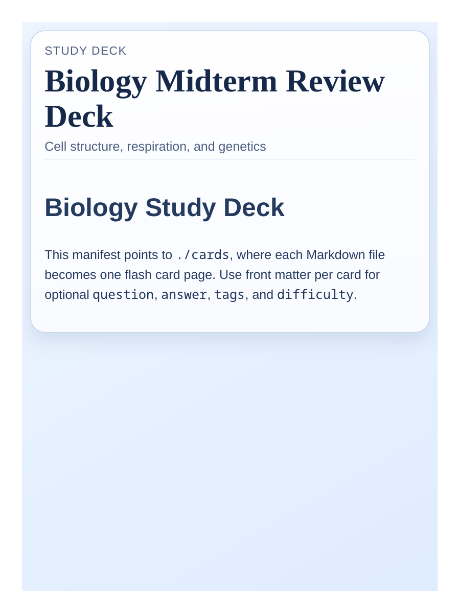
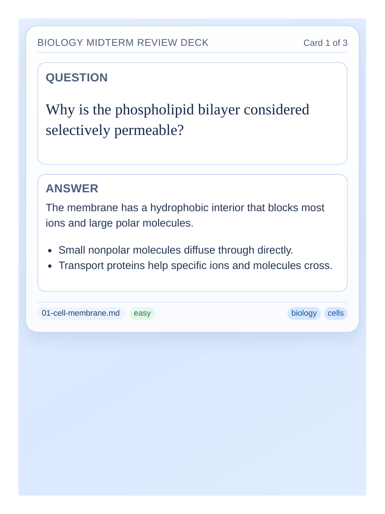
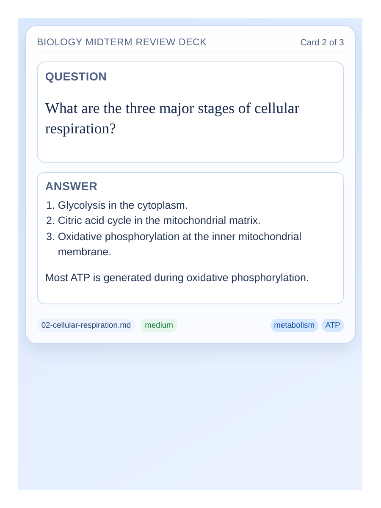
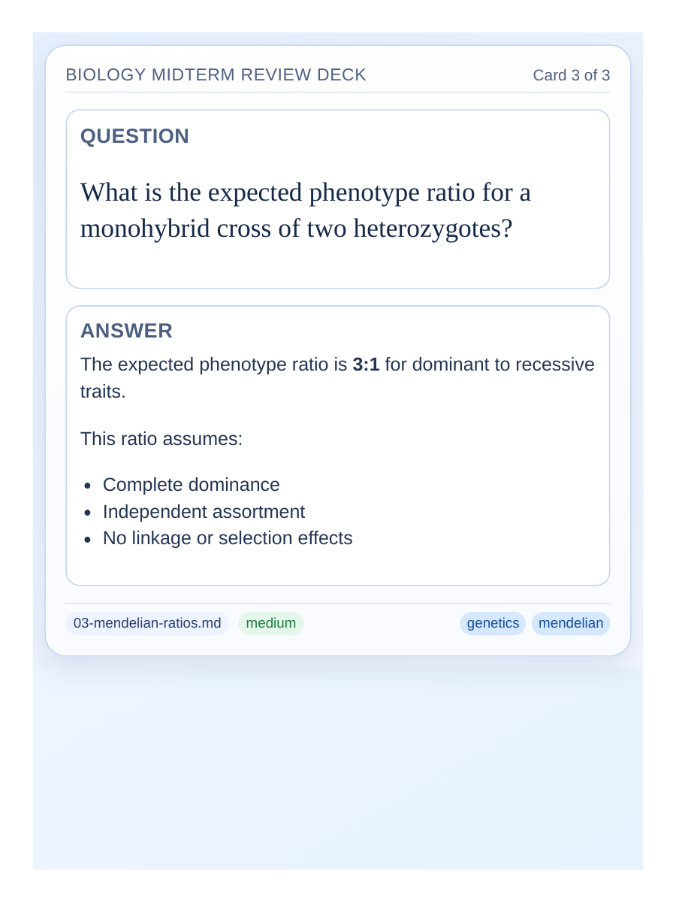
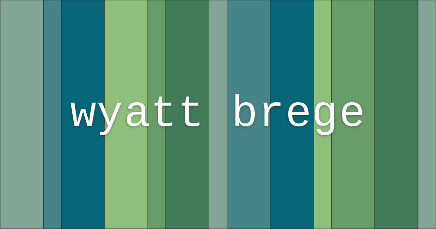
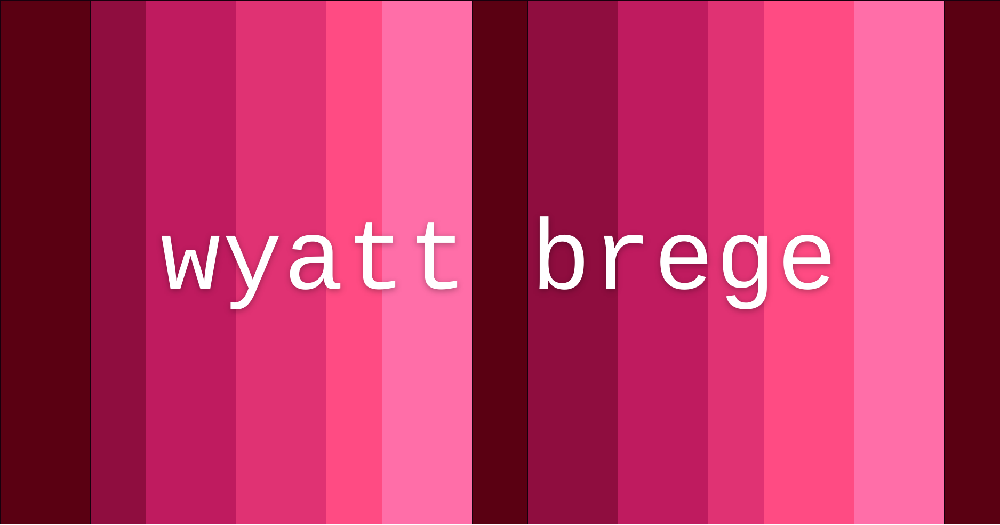

## Claude Skills

Examples of Claude skills to build plugins for oshea. See [create-oshea-plugin/SKILL.md](../../.claude/skills/create-oshea-plugin/SKILL.md) for more information.

This also applies to Codex CLI. The repo contains a symlink for Codex CLI.
```
.agents/skills/create-oshea-plugin -> .claude/skills/create-oshea-plugin
```

## 1) Thank You Card

Supplying a short prompt and a reference image.

### Prompt

> `$create-oshea-plugin` Make the plugin that generates this image from markdown. Use plugin name thank-you-card.

### Comparison 

<table>
  <tr>
    <td><a href="../images/ai/thank-you-card.jpg">
      
      <br><strong><a href="https://marketplace.canva.com/EAFoad9JhOw/1/0/1236w/canva-gray-and-brown-simple-business-thank-you-postcard-rzDbHZlQpwI.jpg">Original JPG (canva.com)</a></strong></a>
    </td>
    <td><a href="../images/ai/thank-you-card-ai.png">
      
      <br><strong>Codex 2026-02-23</strong></a>
    </td>
  </tr>
</table>

### Details

```
cli:            OpenAI Codex (v0.104.0)
model:          gpt-5.3-codex high
date:           2026-02-22
duration:       6 minutes
plugin dir:     plugins/thank-you-card/
output pdf:     /tmp/oshea-output/thank-you-card.pdf
```

### Optional feedback

> *isolate the SVG generation in a separate pass or through the web console*

> *explicitly tell the agent to fix the vertical alignment*

> *share the screenshot with the agent so it can compare to the reference*

## 2) Study Cards

Building a plugin from a prompt alone. The agent did not use [`docs/walkthroughs/generate-mobile-study-cards.md`](../walkthroughs/generate-mobile-study-cards.md).

### Prompt

> `$create-oshea-plugin` Make an oshea plugin named study-card-deck that generates a deck PDF from a directory of markdown study cards.

### Output

<table>
  <tr>
    <td><a href="../images/ai/study-card-deck-1.png">
      
      <br><strong>Card 1</strong></a>
    </td>
    <td><a href="../images/ai/study-card-deck-2.png">
      
      <br><strong>Card 2</strong></a>
    </td>
    <td><a href="../images/ai/study-card-deck-3.png">
      
      <br><strong>Card 3</strong></a>
    </td>
    <td><a href="../images/ai/study-card-deck-4.png">
      
      <br><strong>Card 4</strong></a>
    </td>
  </tr>
</table>

### Details

```
cli:            OpenAI Codex (v0.104.0)
model:          gpt-5.3-codex high
date:           2026-02-23
duration:       4 minutes
plugin dir:     plugins/study-card-deck
output pdf:     /tmp/oshea-output/biology-midterm-review-deck.pdf
```

### Optional feedback

> i wanted flip cards for memorization

## 3) GitHub Social Preview

Copying from a plugin on GitHub with certain tweaks.

### Prompt

> `$create-oshea-plugin` Make an oshea plugin named gh-social-preview-gold that is created from https://github.com/brege/gh-social-preview, but use the golden ratio and use a red and magenta color palette. keep the text and layout otherwise unchanged.

### Comparison

<table>
  <tr>
    <td><a href="../images/ai/gh-social-preview.png">
      
      <br><strong>Source plugin (silver ratio)</strong></a>
    </td>
    <td><a href="../images/ai/gh-social-preview-ai.png">
      
      <br><strong>Codex output (gold ratio)</strong></a>
    </td>
  </tr>
</table>

<details>
<summary>Agent Diff</summary>

```
• Edited plugins/gh-social-preview-gold/default.yaml (+1 -1)
    1 -plugin_name: gh-social-preview
    1 +plugin_name: gh-social-preview-gold
    2  version: 1.0.0

• Edited plugins/gh-social-preview-gold/index.js (+3 -3)
     1 -// plugins/gh-social-preview/index.js
     1 +// plugins/gh-social-preview-gold/index.js
     2  const fs = require('fs').promises;
       ⋮
    16    async generate(data, pluginSpecificConfig, globalConfig, outputDir, outputFilenameOpt, pluginBa
        sePath) {
    17 -    logger.info(`(GhSocialPreviewHandler): Processing for plugin '${pluginSpecificConfig.descript
        ion || 'gh-social-preview'}'.`);
    17 +    logger.info(`(GhSocialPreviewHandler): Processing for plugin '${pluginSpecificConfig.descript
        ion || 'gh-social-preview-gold'}'.`);
    18
       ⋮
    44
    45 -      const cardNameForFile = fm.name || (markdownBody.split('\n')[0].replace(/^#+\s*/, '')) || '
        gh-social-preview';
    45 +      const cardNameForFile = fm.name || (markdownBody.split('\n')[0].replace(/^#+\s*/, '')) || '
        gh-social-preview-gold';
    46        const baseOutputFilename = outputFilenameOpt || `${this.markdownUtils.generateSlug(cardName
        ForFile)}.pdf`;

• Edited plugins/gh-social-preview-gold/ribbon.js (+12 -12)
     4  function generateSVG() {
     5 -  const silver = 1 + Math.sqrt(2);
     6 -  const gruvbox = [
     7 -    '#83a598',
     8 -    '#458588',
     9 -    '#076678',
    10 -    '#8ec07c',
    11 -    '#689d6a',
    12 -    '#427b58',
     5 +  const goldenRatio = (1 + Math.sqrt(5)) / 2;
     6 +  const redMagenta = [
     7 +    '#5a0012',
     8 +    '#8f0d3f',
     9 +    '#bf1b5f',
    10 +    '#e03273',
    11 +    '#ff4b83',
    12 +    '#ff6ea8',
    13    ];
       ⋮
    25    for (let char of sequence) {
    26 -    totalWidth += char === 'S' ? 1 : silver;
    26 +    totalWidth += char === 'S' ? 1 : goldenRatio;
    27    }
       ⋮
    29    const S_width = 1200 / totalWidth;
    30 -  const L_width = S_width * silver;
    30 +  const L_width = S_width * goldenRatio;
    31    const height = 630;
       ⋮
    33    let svg = '<svg width="1200" height="630" xmlns="http://www.w3.org/2000/svg">';
    34 -  svg += '<rect width="1200" height="630" fill="#282828"/>';
    34 +  svg += '<rect width="1200" height="630" fill="#260014"/>';
    35
       ⋮
    40      const width = char === 'S' ? S_width : L_width;
    41 -    svg += `<rect x="${x}" y="0" width="${width}" height="${height}" fill="${gruvbox[i % gruvbox.
        length]}" stroke="#1d2021" stroke-width="0.5"/>`;
    41 +    svg += `<rect x="${x}" y="0" width="${width}" height="${height}" fill="${redMagenta[i % redMa
        genta.length]}" stroke="#17000d" stroke-width="0.5"/>`;
    42      x += width;
```

</details>

### Details

```
cli:            OpenAI Codex (v0.106.0)
model:          gpt-5.3-codex medium
date:           2026-02-27
duration:       2 minutes
plugin dir:     plugins/gh-social-preview-gold/
source plugin:  https://github.com/brege/gh-social-preview
```

### Optional feedback

> the ratio is for the division of bands, not just their relative sizing. see path/to/my/paper.tex, this may be a bug with upstream

> stagger the colors instead of descending in a gradient
