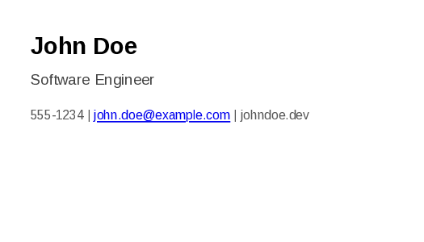

# Plugin Development Guide - md-to-pdf

This document serves as a comprehensive reference for creating, configuring, and managing custom plugins for the `md-to-pdf` tool. For general usage and quick examples, please refer to the main [README.md](../README.md) and the [cheat-sheet.md](cheat-sheet.md).

## Understanding Plugins

Plugins are the core of `md-to-pdf`'s extensibility. They allow you to define custom processing, styling, and PDF generation options for different types of Markdown documents. Whether you're creating a CV, a recipe, a technical report, or any other document, a plugin provides the tailored environment for that specific output.

Each plugin is typically a self-contained directory that bundles
* A configuration manifest (`<plugin-name>.config.yaml`)
* A Node.js handler script (usually `index.js`)
* Custom CSS files

## Plugin Anatomy

A plugin for `md-to-pdf` is a self-contained directory that bundles configuration, styling, and logic for processing a specific type of Markdown document.

### Core Directory Structure

Typically, a plugin resides in its own directory. For example, a plugin named `my-invoice` would be structured as

    my-custom-plugins/
    └── my-invoice/
        ├── my-invoice.config.yaml  # Primary configuration (manifest)
        ├── index.js                # Node.js handler script
        └── my-invoice.css          # Custom CSS styles

### 1. Plugin Configuration

#### `<plugin-name>.config.yaml`

This YAML file is the manifest for your plugin. It defines its properties and behavior.

##### Properties

* `description` (string) A brief description of the plugin.

  *Example*

      "Plugin for generating professional invoices."

* `handler_script` (string) The path to the Node.js handler script, relative to this configuration file.

  *Example*

      "index.js"

* `css_files` (array of strings) A list of CSS files to be applied. Paths are relative to this configuration file.

  *Example*

      ["my-invoice.css", "theme-print.css"]

* `pdf_options` (object) Puppeteer PDF generation options specific to this plugin. These can override global settings.

  *Example*

      pdf_options:
        format: "A4"
        margin: { top: "2cm", bottom: "2cm", left: "1.5cm", right: "1.5cm" }
        printBackground: true

* `math` (object, optional) Configuration for KaTeX math rendering.
    * `enabled` (boolean) `true` to enable, `false` (default for new plugins) to disable.
    * `engine` (string) Currently only `"katex"` is supported.
    * `katex_options` (object) KaTeX specific options (see KaTeX documentation).

        *Example*

          math:
            enabled: true
            katex_options:
              throwOnError: false
              trust: false # Recommended for security
              macros: { "\\RR": "\\mathbb{R}" }

* `toc_options` (object, optional) Configuration for Table of Contents generation.

  *Example*

        toc_options:
          enabled: true
          placeholder: "%%TOC%%" # Marker in Markdown for ToC insertion
          level: [1, 2, 3]       # Heading levels to include
          listType: "ul"         # 'ul' or 'ol'

* `inject_fm_title_as_h1` (boolean, optional) \
  If `true`, uses the `title` from front matter as the main H1 heading of the document. Default is often `true` for simple document plugins. For handlers that generate custom HTML, this should typically be `false`.

* `aggressiveHeadingCleanup` (boolean, optional) \
  If `true`, attempts to remove existing H1/H2 headings from the Markdown content, useful if `inject_fm_title_as_h1` is also true to prevent duplicate titles. Often `false` for custom HTML handlers.

* `watch_sources` (array of objects, optional) \
  Defines additional files or directories for `md-to-pdf` to monitor in `--watch` mode.

  *Example*

      watch_sources:
        - type: "file" # Watch a single file
          path: "data/invoice-data.json" # Relative to this plugin's config file
        - type: "directory" # Watch a directory
          path_from_cli_arg: "customerDataDir" # Path comes from a CLI argument
        - type: "glob" # Watch using a glob pattern
          base_path_from_cli_arg: "projectRoot" # Base for the glob pattern
          pattern: "templates/**/*.hbs"

* `params` (object, optional) \
  Defines default parameters specific to this plugin, which can be used as placeholders. These are lower precedence than global `params`, local file `params`, and front matter.

  *Example*

      params:
        default_theme_color: "blue"
        plugin_version: "1.2.3"

### 2. Handler Script

#### `index.js`

The handler script is a Node.js module responsible for processing the input data and generating the HTML content that will be converted to PDF.

**Interface**

The script must export a class. This class should have
1.  A `constructor(coreUtils)` Receives an object containing core `md-to-pdf` utilities.
2.  An asynchronous `generate(...)` method.

**`coreUtils` Object**

The `constructor` receives an object with the following utilities, injected by `PluginManager.js`

| Utility         | Description                                                                                                                                |
|-----------------|--------------------------------------------------------------------------------------------------------------------------------------------|
| `DefaultHandler`  | The standard handler class. Useful for plugins that need common Markdown-to-HTML processing but with custom configurations or minor tweaks. |
| `markdownUtils` | An object with helper functions like `extractFrontMatter()`, `renderMarkdownToHtml()`, `substituteAllPlaceholders()`, and `generateSlug()`.      |
| `pdfGenerator`  | An object with the `generatePdf()` function for direct PDF creation from an HTML string, CSS, and PDF options.                             |

**`generate` Method Signature and Parameters**

The `generate` method is the core of your plugin's logic. It must have the following signature

```javascript
async generate(data, pluginSpecificConfig, globalConfig, outputDir, outputFilenameOpt, pluginBasePath)
```

Here's a breakdown of its parameters

| Parameter           | Type             | Description                                                                                                                                                              |
|---------------------|------------------|--------------------------------------------------------------------------------------------------------------------------------------------------------------------------|
| `data`              | `object`         | Input data for the plugin. For `convert` commands, this usually contains `{ markdownFilePath: 'path/to/file.md' }`. For `generate` commands, it often contains `{ cliArgs: {...} }` with arguments passed after the plugin name. |
| `pluginSpecificConfig` | `object`         | The fully resolved configuration object specifically for this plugin instance. This includes settings from the plugin's own `<plugin-name>.config.yaml` merged with any applicable user-global or project-level overrides. |
| `globalConfig`      | `object`         | The main global configuration object loaded by `md-to-pdf` (e.g., from `config.yaml` in the project root, user's config directory, or specified via `--config`). This object includes global `params` and `global_pdf_options`. |
| `outputDir`         | `string`         | The absolute path to the directory where the output PDF file should be saved.                                                                                              |
| `outputFilenameOpt` | `string` (opt)   | The desired filename for the PDF (e.g., "my-document.pdf"), if specified by the user via the `--filename` option. If not provided, the plugin should generate a suitable name. |
| `pluginBasePath`    | `string`         | The absolute path to the root directory of the plugin (i.e., the directory containing its `<plugin-name>.config.yaml`). This is crucial for resolving relative paths to assets like CSS files or templates within the plugin. |
| **Returns** | `Promise<string>` | The method must return a Promise that resolves to a string containing the absolute path to the generated PDF file.                                                       |

**Example Simple Handler using `DefaultHandler`**

This is suitable for plugins that largely follow standard Markdown processing but need specific CSS, PDF options, or minor pre/post processing.

```javascript
// my-invoice/index.js
class MyInvoiceHandler {
    constructor(coreUtils) {
        // coreUtils contains { DefaultHandler, markdownUtils, pdfGenerator }
        this.handler = new coreUtils.DefaultHandler();
        // Store other utils if needed:
        // this.markdownUtils = coreUtils.markdownUtils;
        // this.pdfGenerator = coreUtils.pdfGenerator;
    }

    async generate(data, pluginSpecificConfig, globalConfig, outputDir, outputFilenameOpt, pluginBasePath) {
        // You can add custom logic before or after calling the DefaultHandler,
        // or implement entirely custom HTML generation.
        console.log(`INFO (MyInvoiceHandler): Processing invoice with plugin config: ${pluginSpecificConfig.description}`);

        // Example: Modify data or config before passing to DefaultHandler
        // const modifiedData = { ...data, extraInfo: "Important Note" };
        // const modifiedPluginConfig = { ...pluginSpecificConfig, customFlag: true };

        return this.handler.generate(data, pluginSpecificConfig, globalConfig, outputDir, outputFilenameOpt, pluginBasePath);
    }
}
module.exports = MyInvoiceHandler;
```

### 3\. CSS Files

Standard CSS files used to style your document. Paths are specified in your plugin's `css_files` array and are resolved relative to the plugin's `<plugin-name>.config.yaml`.

### Optional Directories

  * `data/` For storing static data files (e.g., JSON, YAML) that your plugin might use.
  * `templates/` If your plugin uses a templating engine (like Handlebars, EJS) for HTML generation, you can store template files here.

## Understanding the Configuration System

`md-to-pdf` uses a layered system for settings, allowing for global defaults, user-specific preferences, and project-level configurations. This section details how configurations are loaded and how plugin behavior is determined and customized.

### Main `config.yaml` Locations & Precedence

`md-to-pdf` looks for a main `config.yaml` file to load global settings (like `pdf_viewer`, global `params` for placeholders) and register plugins. The first file found in the following order of precedence is used as the primary source for global settings

1.  **Project-Specific Configuration** (Highest Precedence) \
    Specified via the `--config <your-project-config.yaml>` CLI option. This file is considered the "project manifest" and is the most specific.

2.  **User-Global Configuration** (Medium Precedence) \
    Located at `~/.config/md-to-pdf/config.yaml` (following XDG Base Directory Specification). This file stores your personal default settings that apply across all projects unless overridden by a project-specific configuration.

3.  **Bundled Configuration** (Lowest Precedence) \
    The `config.example.yaml` file located in the `md-to-pdf` installation directory serves as the ultimate fallback for global settings and bundled plugin registrations if no user or project configuration is found. If a `config.yaml` exists in the project root (alongside `cli.js`), it might be used for bundled plugin definitions, but `config.example.yaml` is the primary source for factory defaults.

#### Factory Defaults Flag

The `--factory-defaults` CLI flag instructs `md-to-pdf` to use *only* the settings and plugin registrations from the bundled `config.example.yaml`, ignoring any user-global (XDG) or project-specific (`--config`) configurations. This is useful for troubleshooting or ensuring a baseline output.

### Plugin Specification & Precedence

When you run `md-to-pdf convert <markdownFile>` or `md-to-pdf <markdownFile>` (lazy load), the tool determines which plugin to use based on the following order of precedence (highest first)

1.  **CLI Option `--plugin <nameOrPath>`** (Highest)
    
    This directly tells `md-to-pdf` which plugin to use.

    * `<nameOrPath>` can be the registered name of a plugin (e.g., `cv`, `my-custom-plugin`).
    
    * Or, it can be a direct path to a plugin's configuration file (e.g., `./path/to/my-plugin.config.yaml`) or to the plugin's root directory (e.g., `./path/to/my-plugin/`). Paths are resolved relative to the current working directory if not absolute.

    **`--plugin <nameOrPath>`**
    ```bash
    md-to-pdf convert mydoc.md --plugin cv
    md-to-pdf convert mydoc.md --plugin ./project_plugins/special_report_style/
    ```

2.  **Markdown Front Matter `md_to_pdf_plugin` Key**
    You can specify the plugin directly within your Markdown file's YAML front matter.

    * The value can be a registered plugin name or a path (relative to the Markdown file).

    **`mydoc.md`**
    ```yaml
    ---
    title: "My Special Document"
    md_to_pdf_plugin: "technical_report" # Registered plugin name
    # Or using a path:
    # md_to_pdf_plugin: "../_shared_plugins/report_variant_blue/"
    ---
    Document content starts here...
    ```

3.  **Local `<filename>.config.yaml` File `plugin` Key**

    For a Markdown file named `mydoc.md`, `md-to-pdf` will automatically look for a `mydoc.config.yaml` file in the same directory.

    * This local config file can specify the plugin using the `plugin` key.
    * The value can be a registered plugin name or a path (relative to this local `.config.yaml` file).

    **`mydoc.config.yaml`**
    ```yaml
    # mydoc.config.yaml
    plugin: "cv" # Use the registered 'cv' plugin
    # Or using a path:
    # plugin: "./specific_cv_settings.config.yaml"

    # Other settings in this file will act as overrides for 'mydoc.md'
    pdf_options:
      format: "A5"
    ```

4.  **Default Plugin** (Lowest)

    If no plugin is specified through any of the above methods, `md-to-pdf` will use the `default` plugin.

### Plugin Registration - `plugins` Key

For a plugin to be usable by its name (e.g., `cv`, `my-invoice`), it must be "registered" in a main `config.yaml` file (Bundled, User-Global, or Project-Specific). This is done under the `plugins` key.

**`~/.config/md-to-pdf/config.yaml`**
```yaml
plugins:
  default: "./plugins/default/default.config.yaml" # Path relative to md-to-pdf install dir if this is bundled
  cv: "./plugins/cv/cv.config.yaml"
  my-invoice: "~/my_custom_plugins/my-invoice/my-invoice.config.yaml" # Absolute/Tilde path
  project-specific-plugin: "./internal_plugins/report_style/report.config.yaml" # Path relative to this config file
```

  * **Paths** 

    Paths to plugin configuration files can be absolute, tilde-expanded (`~`), or relative to the main `config.yaml` file they are defined in.

  * **Plugin Directory Aliases** 

    You can define `plugin_directory_aliases` within a main `config.yaml` to create shorthand paths for your `plugins` registrations.

    **`~/.config/md-to-pdf/config.yaml`**
    ```yaml
    plugin_directory_aliases:
      my_plugins: "~/Projects/md-to-pdf-custom-plugins"
      community: "~/Projects/md-to-pdf/community_plugins"

    plugins:
      invoice: "my_plugins:invoice_generator/invoice.config.yaml"
      advanced-card-red: "community:advanced-card-red/advanced-card-red.config.yaml"
    ```

    Aliases are scoped to the configuration file where they are defined.

### Overriding Plugin Settings

Once a plugin is chosen (e.g., `cv`), its default settings (defined in its own `cv.config.yaml`) can be customized through several layers. Settings from a higher layer will override those from a lower layer.

1.  **Local `<filename>.config.yaml`** (Highest Precedence for a single document)

    If `mydoc.md` has an accompanying `mydoc.config.yaml`, any settings defined in `mydoc.config.yaml` (other than the `plugin` key itself) take the highest precedence for that specific document conversion.

    **`mydoc.config.yaml`**
    ```yaml
    plugin: "cv"                # specifies which plugin's defaults to start with
                                # overrides 'cv' plugin, only for 'mydoc.md'
    pdf_options:
      format: "A5"
      margin: { top: "0.5in", bottom: "0.5in" }
    css_files: ["./special_style_for_mydoc.css"] 
                                # ^ Path relative to this mydoc.config.yaml
    params:
      document_status: "Final Version"
    # cv:                       # incorrect 
    #   some_cv_specific_key: "value_for_this_doc_only"
    ```
    
    `params` defined here also take high precedence for placeholder substitution in `mydoc.md`.
    
    Asset paths (like `css_files`) are resolved relative to this local `<filename>.config.yaml`.

2.  **Project-Specific Main Config Inline Overrides**
    
    In your main project configuration file (specified via `--config your_project.yaml`), you can provide "inline" overrides for any registered plugin by using a top-level key that matches the plugin's name.

    **`your_project.yaml`**
    ```yaml
    plugins:
      cv: "../path_to_actual_cv_plugin/cv.config.yaml" # Registering the base cv plugin
      # ... other plugin registrations ...

    # Inline override for the 'cv' plugin for this project
    cv:
      description: "Project-specific CV Style"
      pdf_options:
        format: "Legal"
      css_files: ["./project_cv_styles/main.css"] # Path relative to 'your_project.yaml'
      params:
        project_name: "Project Alpha"
    ```
    
    Asset paths (like `css_files`) in these inline overrides are resolved relative to the directory of this project-specific main configuration file.

3.  **User-Global Main Config Inline Overrides `~/.config/md-to-pdf/config.yaml`**

    Similar to project-specific inline overrides, you can define overrides in your user-global `config.yaml`. These apply if not superseded by a project-level override or a local `<filename>.config.yaml` override.

    **`~/.config/md-to-pdf/config.yaml`**
    ```yaml
    plugins:
      cv: "/path_to_md_to_pdf_install/plugins/cv/cv.config.yaml" # Bundled CV
      # ... other plugin registrations ...

    # Inline override for the 'cv' plugin for this user
    cv:
      pdf_options:
        margin: { top: "0.75in", bottom: "0.75in" } # User's preferred general margin
      params:
        user_default_email: "user@example.com"
    ```
    Asset paths here are resolved relative to the directory of the user-global `config.yaml`.

4.  **Plugin's Own Default Configuration** (Lowest Precedence for settings)

    These are the settings defined directly in the plugin's own `<plugin-name>.config.yaml` file (e.g., `md-to-pdf/plugins/cv/cv.config.yaml`).

**Key Points on Overrides**

  * The `plugins` key in main configuration files is for *registering* plugins and their base configuration file paths.
  * Top-level keys matching a plugin's name (e.g., a `cv:` block) in main configuration files are for *overriding the settings* of that registered plugin.
  * The local `<filename>.config.yaml` provides the most specific overrides for a single document.

**CSS Merging with `inherit_css`**

When `css_files` are specified in an override layer (Local `<filename>.config.yaml`, Project, or User-Global inline):

  * `inherit_css: true` Appends CSS files from the current layer to those from lower layers.
  * `inherit_css: false` (or if the key is absent) Replaces all CSS from lower layers with only those from the current layer.

### Global `params`, Front Matter, and Placeholders

`md-to-pdf` allows you to define data in various places and use it as placeholders (e.g., `{{ .myKey }}`) in your Markdown content. This is primarily processed by plugins using the `DefaultHandler` or similar logic.

#### Defining Data

1.  **Global `params` in Main `config.yaml`**

    Define reusable key-value pairs in your active main `config.yaml` (Bundled, User-Global, or Project-specific) under a top-level `params:` key.

    **`~/.config/md-to-pdf/config.yaml`**
    ```yaml
    params:
      site:
        name: "My Company Website"
        defaultTheme: "Blue"
      contact_info: # Renamed to avoid conflict with potential 'contact' in FM
        email: "info@example.com"
        phone: "555-123-4567"
      copyrightYear: "{{ .CurrentDateISO | slice:0:4 }}" # Placeholder referencing another placeholder
    ```

2.  **Document-Specific `params` in Local `<filename>.config.yaml`**

    Define `params` within a local `<filename>.config.yaml` that will only apply to its corresponding Markdown document. These override global `params`.

    **`mydoc.config.yaml`**
    ```yaml
    plugin: "default"
    params:
      document_status: "Confidential Draft"
      project_code: "Alpha-123"
      contact_info: # Overrides the global contact_info for this document
        email: "project.alpha@example.com"
    ```

3.  **Document Front Matter**

    Markdown files can include YAML front matter for document-specific metadata and data. Front matter data takes the highest precedence.

    **`mydoc.md`**
    ```yaml
    ---
    title: "My Document Title"
    author: "Author Name"
    date: "{{ .CurrentDateISO }}" # Dynamic date placeholder
    # Front matter can also have its own 'params' key for grouping,
    # or keys can be at the top level of front matter.
    # For simplicity, top-level keys are often easiest.
    page_specific_param: "Unique to this page"
    document_status: "Final Approved" # Overrides local config and global params
    contact_info: # This will override the entire 'contact_info' object from local/global params
      email: "document.author@example.com"
      office: "Room 101"
    custom_data:
      key: "Some value"
    ---

    Document content...
    Status {{ .document_status }}.
    Project Code {{ .project_code }}.
    Contact {{ .contact_info.email }} at office {{ .contact_info.office }}.
    Site theme {{ .site.defaultTheme }}.
    Page Specific {{ .page_specific_param }}.
    Custom data {{ .custom_data.key }}.
    ```

#### Placeholder Context and `params` Merging Precedence

When placeholders are processed, the data context is built by merging `params` from various sources, along with top-level front matter keys. The order of precedence (highest wins) is

  1.  **Document Front Matter**  \
      Top-level keys and keys under a `params:` block within front matter are merged into the context. Direct top-level keys from front matter generally override any identically named keys from `params` objects from other sources if they collide at the root of the context.

  2.  **Local `<filename>.config.yaml` `params`**

  3.  **Plugin-Specific Override `params`** \
       Defined within an inline override block for the plugin, e.g., in a project `config.yaml`: `cv: { params: { cv_specific: "value" } }`

  4.  **Plugin Default `params`** \
      Defined in the plugin's own `<plugin-name>.config.yaml` under its `params:` key

  5.  **Global `params`** \
      From the active main `config.yaml`

#### Merging Precedence

During merging, objects are deeply merged. For example, if global `params` define 

    contact_info: { email: "global@example.com", phone: "555-GLOBAL" }

and front matter defines

    contact_info: { email: "fm@example.com", fax: "555-FAX" } 

the resulting `contact_info` in the context will be:

    { email: "fm@example.com", phone: "555-GLOBAL", fax: "555-FAX" }`

#### Automatic Date Placeholders

The following date placeholders are always available

  * `{{ .CurrentDateFormatted }}` e. "May 26, 2025" (locale-dependent long format).
  * `{{ .CurrentDateISO }}` e. "2025-05-26".

#### Placeholder Syntax

Placeholders use the syntax `{{ .key }}` or `{{ .path.to.key }}` (e.g., `{{ .custom_data.key }}`, `{{ .site.name }}`, `{{ .document_status }}`). The leading `.` refers to the root of the final merged data context. If a key is not found, a warning is logged, and the placeholder string remains in the output.

### Verifying Your Configuration

To understand the active global settings or the final merged settings for a specific plugin (including all `params` and other configurations), use the `md-to-pdf config` command.

```bash
md-to-pdf config
md-to-pdf config --plugin cv
md-to-pdf config --plugin cv --pure # For raw YAML output
```

This is invaluable for debugging how settings and `params` are being applied. Refer to the [Cheat Sheet](docs/cheat-sheet.md#configuration-inspection) for more examples.


### Plugin Help via CLI

Usage:
```bash
md-to-pdf plugin help <your-plugin-name>
```

Example:
```bash
md-to-pdf plugin help cv
```

So concludes **Plugin Anatomy**.  This is a natural segue to **Creating Plugins**. 

---

# Creating Plugins

This section transitions from a reference manual language toward a step-by-step guide for creating plugins with `md-to-pdf`.

There are four main components to a plugin:

1. **Configuration** - `<plugin-name>.config.yaml`

2. **Styling** - `<plugin-name>.css`

3. **Handler** - `index.js`

4. **Documentation** - `README.md`
    - YAML front matter holds [**Help**](#plugin-help) text for the plugin
    - Parsed directly by our own Markdown utilities

Some plugins may also contain:
  - a sample (front mattered) Markdown document, for reference.
  - an asset directory, e.g., `assets/`, containing images, fonts, etc.
  - a data directory, e.g., `data/`, containing external data files: `.json`, `.csv`, etc.
  - a test directory, e.g., `test/`, containing a unit test(s).

## Scaffolding a New Plugin with `plugin create`

The easiest way to start a new plugin is with the `plugin create` command. This command generates a boilerplate directory structure and essential files for a simple plugin.

### Command Syntax

```bash
md-to-pdf plugin create <new-plugin-name> [--dir <target-directory>] [--force]
```

  * `<new-plugin-name>` \
    The name for your plugin (e.g., `business-card`, `my-report`).

  * `--dir <target-directory>` (Optional) \
    The directory *within which* your new plugin folder will be created. Defaults to the current working directory.

  * `--force` (Optional) \
    If the target plugin directory already exists, this flag allows overwriting its contents.

### Plugin Help Mechanism

Create or update a `README.md` file in the root of your plugin's directory (e.g., `my-custom-plugins/my-invoice/README.md`). Add a YAML front matter block at the top of this file with a `cli_help` key. The value of this key should be a multiline string containing the help text you want to display.

#### Example

`README.md` for `my-invoice` plugin.

```markdown
---
cli_help: |
  Plugin: my-invoice
  Description: Generates professional invoices from Markdown files.

  Key Features:
    - Customizable templates.
    - Supports line items, taxes, and discounts.
    - Outputs clean, well-formatted PDFs.

  Expected Front Matter:
    - `invoice_number`: (string) Unique invoice identifier.
    - `client_name`: (string) Name of the client.
    - `items`: (array) List of line items, each with 'description', 'quantity', 'price'.
    - `tax_rate`: (number, optional) Percentage tax rate.

  Configuration Notes (my-invoice.config.yaml):
    - `css_files`: Path to CSS for invoice styling.
    - `pdf_options`: Page size, margins.
    - `template_file`: (optional) Path to a custom HTML template for the invoice.

  Example Usage:
    md-to-pdf convert new_invoice.md --plugin my-invoice
---

# My Invoice Plugin (`my-invoice`)

This plugin helps you create professional invoices from simple Markdown files...
```
Keep this help text current with your plugin's features.

If a plugin's `README.md` is missing, or if the `cli_help` key is absent from its front matter, `md-to-pdf plugin help <pluginName>` will display the plugin's `description` from its `*.config.yaml` file as a fallback.

## Simple Plugin Walkthrough

### Creating a "business-card" plugin



```bash
md-to-pdf plugin create business-card --dir ./my_custom_plugins
```

This command will create the following structure

```
./my_custom_plugins/
└── business-card/
    ├── business-card.config.yaml
    ├── business-card.css
    ├── index.js
    └── README.md
```

**Generated Files**

  * **`business-card.config.yaml`** \
    A basic configuration manifest. You'll customize fields like `description`, `pdf_options` (e.g., to set specific dimensions for a business card), etc. The `README.md` will also be pre-filled with a `cli_help` section.

    ```yaml
    # my_plugins/business-card/business-card.config.yaml
    description: "A new business-card plugin for [purpose]."
    handler_script: "index.js"
    css_files:
      - "business-card.css"
    pdf_options:
      format: "Letter" # You would change this, e.g., width: "3.5in", height: "2in"
      margin: { top: "1in", right: "1in", bottom: "1in", left: "1in" }
    math:
      enabled: false
    ```

  * **`index.js`** \
    A handler script that uses `DefaultHandler` by default. You can modify this for custom logic.

    ```javascript
    // my_plugins/business-card/index.js
    class BusinessCardHandler { // Name will be based on your plugin name
        constructor(coreUtils) {
            this.handler = new coreUtils.DefaultHandler();
        }
        async generate(data, pluginSpecificConfig, globalConfig, outputDir, outputFilenameOpt, pluginBasePath) {
            console.log(`INFO (BusinessCardHandler): Processing for plugin '${pluginSpecificConfig.description || 'business-card'}'`);
            return this.handler.generate(data, pluginSpecificConfig, globalConfig, outputDir, outputFilenameOpt, pluginBasePath);
        }
    }
    module.exports = BusinessCardHandler;
    ```

  * **`business-card.css`** \
    A placeholder CSS file for your custom styles.
  
  * **`README.md`** \
    A basic README with a pre-filled `cli_help` section for your plugin.

### Next Steps After Scaffolding

1.  **Customize Files** \
    Edit the generated `.config.yaml`, `index.js` (if needed), `.css`, and `README.md` files to match your plugin's requirements.
2.  **Register** \
    Add your plugin to a main `config.yaml` as described in the "Plugin Discovery and Registration" section.
3.  **Test** \
    Use your plugin with the `md-to-pdf convert` or `generate` command.

For a complete, working example of a custom "business-card" plugin, you can also inspect the one used in our test kit located at [`test/custom_plugins/business-card/`](../test/custom_plugins/business-card/).

To compile and view the sample [`example-business-card.md`](../test/assets/example-business-card.md) using the test `business-card` plugin, which is registered in [`test/config.test.yaml`](../test/config.test.yaml):

```bash
md-to-pdf convert test/assets/example-business-card.md \
    --plugin business-card \
    --config test/config.test.yaml
```

Refer to the [**cheat-sheet.md**](cheat-sheet.md#plugin-management-commands) for more command syntax details.

## Advanced Example 

### 'advanced-card' Plugin for Custom HTML and Dynamic Content

The standard Markdown-to-HTML conversion offered by `DefaultHandler` might not always be sufficient. You might need a highly specific HTML structure, want to integrate dynamic content (like a QR code), or process the Markdown body in a unique way. This is where the extensibility of the custom plugin handler comes in.


The **advanced-card** plugin serves as an example of this. It generates a business card where

  * The main content (name, title, company, contact details) is written directly in the Markdown file's body using standard Markdown syntax (e.g., H1 for name, H2 for title).
  * Front matter is used for auxiliary data like a website URL (for a QR code) or branding colors.
  * A QR code is dynamically generated.
  * The plugin constructs a custom HTML layout and directly calls the PDF generation utility.

**Location**

[`examples/custom_plugin_showcase/advanced-card/`](../examples/custom_plugin_showcase/advanced-card/)

### Why a Custom Handler for "advanced-card"?

  * **Precise Layout Control** \
    Business cards have specific layout requirements that are easier to achieve with custom HTML and CSS than by trying to style generic Markdown output.
  * **Dynamic Content Integration** \
    We want to include a QR code whose data can come from front matter or global parameters.
  * **Processing Markdown Body** \
    Instead of just relying on front matter for all data, this example shows how to take the Markdown content written by the user (e.g., their name as an H1, title as H2) and incorporate that rendered HTML into a custom card structure.

### 1. Example Markdown

#### `advanced-card-example.md`

The user provides card details using standard Markdown formatting.

```markdown
---
# Front matter for auxiliary data
website: https://www.innovatech.example.com/evance   # Used for QR if qr_data is not set
qr_data: "mailto:e.vance@innovatech.example.com"     # Specific data for the QR code
brandingColor: "#2a9d8f"                             # Custom branding color for top border
---

# Dr. Eleanor Vance
## Lead Research Scientist
### Innovatech Solutions Ltd.

**Email:** e.vance@innovatech.example.com
**Phone:** +1-555-0102
**Web:** [innovatech.example.com/evance](https://www.innovatech.example.com/evance)

*Creative Solutions through Scientific Excellence*
```

You could, of course, configure your name, phone number, email, etc in the front matter—or, better yet, in the `params` portion of your global `config.yaml` file—but for readability we only add dynamic parameters in this example. E.g., `**Web:** [{{ .website }}]({{ .website }})`.

### 2. Plugin Configuration

#### `advanced-card.config.yaml`

This config defines the card's dimensions and other essential settings.

```yaml
# examples/custom_plugin_showcase/advanced-card/advanced-card.config.yaml
description: "An advanced card plugin demonstrating custom HTML from Markdown body and dynamic content."
handler_script: "index.js"
css_files:
  - "advanced-card.css"

pdf_options:
  width: "3.5in"  # Standard business card width
  height: "2in"   # Standard business card height
  margin:
    top: "0.15in"
    right: "0.15in"
    bottom: "0.15in"
    left: "0.15in"
  printBackground: true # Important for cards that use background colors/images

inject_fm_title_as_h1: false    # H1 comes from Markdown body
aggressiveHeadingCleanup: false
math:
  enabled: false
```

**Key Points**

  * `width` and `height` are set for a typical business card.
  * `margin` is kept small.
  * `printBackground: true` ensures CSS backgrounds are rendered in the PDF.
  * `inject_fm_title_as_h1: false` is crucial because the main heading (the person's name) will come from the H1 tag in the Markdown body.

### 3. Handler Script Snippet

#### `advanced-card/index.js`

The handler reads the Markdown, renders its body to HTML, prepares dynamic data (QR code), and constructs the final HTML for the card.

```javascript
// examples/custom_plugin_showcase/advanced-card/index.js
const fs = require('fs').promises;
const fss = require('fs'); // Synchronous for operations like existsSync
const path = require('path');

class AdvancedCardHandler {
    constructor(coreUtils) {
        this.markdownUtils = coreUtils.markdownUtils;
        this.pdfGenerator = coreUtils.pdfGenerator;
    }

    async generate(data, pluginSpecificConfig, globalConfig, outputDir, outputFilenameOpt, pluginBasePath) {
        const { markdownFilePath } = data;
        // ... (error checking for markdownFilePath) ...

        const rawMarkdownContent = await fs.readFile(markdownFilePath, 'utf8');
        const { data: fm, content: markdownBody } = this.markdownUtils.extractFrontMatter(rawMarkdownContent);
        const globalParams = globalConfig.params || {};

        // Render the main Markdown body to HTML
        const renderedMarkdownHtml = this.markdownUtils.renderMarkdownToHtml(
            markdownBody,
            pluginSpecificConfig.toc_options,
            (pluginSpecificConfig.pdf_options || {}).anchor_options, // Pass anchor options
            pluginSpecificConfig.math
        );

        // Determine QR code data and URL
        const qrDataSource = fm.qr_data || fm.website || globalParams.defaultWebsite || '[https://example.com](https://example.com)';
        const qrCodeUrl = `https://api.qrserver.com/v1/create-qr-code/?size=80x80&data=${encodeURIComponent(qrDataSource)}`;
        const cardBrandingColor = fm.brandingColor || globalParams.defaultBrandingColor || '#333';

        // Construct custom HTML layout, injecting the rendered Markdown
        const htmlBodyContent = `
            <div class="card-container" style="border-top: 5px solid ${cardBrandingColor};">
                <div class="main-content-from-markdown">
                    ${renderedMarkdownHtml}
                </div>
                <div class="qr-code-section">
                    
                </div>
                ${globalParams.companyLogoUrl ? `` : ''}
            </div>
        `;

        const cardNameForFile = fm.name || (markdownBody.split('\n')[0].replace(/^#+\s*/, '')) || 'advanced-card';
        const baseOutputFilename = outputFilenameOpt || `${this.markdownUtils.generateSlug(cardNameForFile)}.pdf`;
        const finalOutputPdfPath = path.join(outputDir, baseOutputFilename);

        // Merge PDF options (plugin's own config should define card dimensions)
        const pdfOptions = { /* ... merge global and plugin-specific pdf_options ... */ };
        if (pdfOptions.width || pdfOptions.height) { delete pdfOptions.format; }


        // Load CSS files
        const cssFileContentsArray = [];
        // ... (logic to load CSS files specified in pluginSpecificConfig.css_files) ...

        // Generate PDF directly
        await this.pdfGenerator.generatePdf(
            htmlBodyContent,
            finalOutputPdfPath,
            pdfOptions,
            cssFileContentsArray
        );
        return finalOutputPdfPath;
    }
}
module.exports = AdvancedCardHandler;
```

**How the handler works**

  * It uses `this.markdownUtils.extractFrontMatter` and `this.markdownUtils.renderMarkdownToHtml` to process the input.
  * It constructs `htmlBodyContent` by injecting `renderedMarkdownHtml` into a custom `div` structure. This structure also includes a placeholder for the QR code and an optional company logo (from global params).
  * It uses `this.pdfGenerator.generatePdf` to directly render the PDF from this custom HTML string, its own CSS, and specific PDF options.

### 4. CSS Styling Snippet

#### `advanced-card/advanced-card.css`

The CSS targets the custom HTML structure and the standard HTML elements generated from the Markdown body.

```css
/* examples/custom_plugin_showcase/advanced-card/advanced-card.css */
body { /* Styles applied to the Puppeteer page context */
    margin: 0;
    font-family: Arial, Helvetica, sans-serif;
    font-size: 9pt; /* Base for card */
    /* ... other body styles ... */
}
.card-container {
    width: 100%; height: 100%;
    padding: 10px;
    position: relative; /* For absolute positioning of QR */
    overflow: hidden;
    /* ... other container styles ... */
}
.main-content-from-markdown {
    line-height: 1.3;
    padding-bottom: 5px; /* To prevent overlap with QR */
}
.main-content-from-markdown h1 { font-size: 14pt; /* ... */ }
.main-content-from-markdown h2 { font-size: 12pt; /* ... */ }
.main-content-from-markdown h3 { font-size: 10pt; /* ... */ }
.main-content-from-markdown p  { font-size: 8pt;  /* ... */ }

.qr-code-section {
    position: absolute;
    bottom: 10px; right: 10px;
    width: 46px; height: 46px;
}
.qr-code-section img { width: 100%; height: 100%; }
/* ... other styles ... */
```

This **advanced-card** example illustrates how to take full control when the standard `DefaultHandler` doesn't meet your needs, allowing for complex layouts, dynamic data, and custom processing of Markdown content.

### 5. Execution

To compile and view the [`advanced-card-example.md`](../examples/custom_plugin_showcase/advanced-card/advanced-card-example.md) using this **advanced-card** plugin, which should be registered in a main `config.yaml` pointing to
[`examples/custom_plugin_showcase/advanced-card/advanced-card.config.yaml`](../examples/custom_plugin_showcase/advanced-card/advanced-card.config.yaml),
run the following command

```bash
md_file=examples/custom_plugin_showcase/advanced-card/advanced-card-example.md
md-to-pdf convert $md_file --plugin advanced-card --outdir ./test_output --watch
```

This also highlights the use of the `--watch` flag, which is quite handy when iterating CSS and JavaScript tweaks.

You can find the full source code for this **advanced-card** plugin, including the example Markdown file, in the
[`examples/custom_plugin_showcase/advanced-card/`](../examples/custom_plugin_showcase/advanced-card/)
directory, which contains

```bash
examples/custom_plugin_showcase/advanced-card/
├── advanced-card.config.yaml   # Plugin configuration
├── advanced-card.css           # Custom CSS
├── advanced-card-example.md    # Example Markdown
└── index.js                    # Plugin handler
```

## Other Advanced Topics

### Using `watch_sources`

If your plugin relies on external data files or templates that should trigger a rebuild in `--watch` mode, define them in the `watch_sources` array in your plugin's `<plugin-name>.config.yaml`. 

Refer to the example under the "Plugin Configuration (`<plugin-name>.config.yaml`)" section, specifically the "Key Fields" discussion.

### Accessing CLI Arguments in "Generate" Plugins

For plugins invoked with the `generate` command (e.g., `md-to-pdf generate my-data-processor --custom-arg value`), any additional command-line arguments (like `--custom-arg value`) are passed to your plugin's `generate` method within the `data.cliArgs` object

```javascript
// In your plugin's index.js
async generate(data, pluginSpecificConfig, /* ...other args */) {
    const customArgument = data.cliArgs && data.cliArgs.customArg;
    if (customArgument) {
        console.log("Received custom argument:", customArgument);
    }
    // ... rest of your logic
}
```

