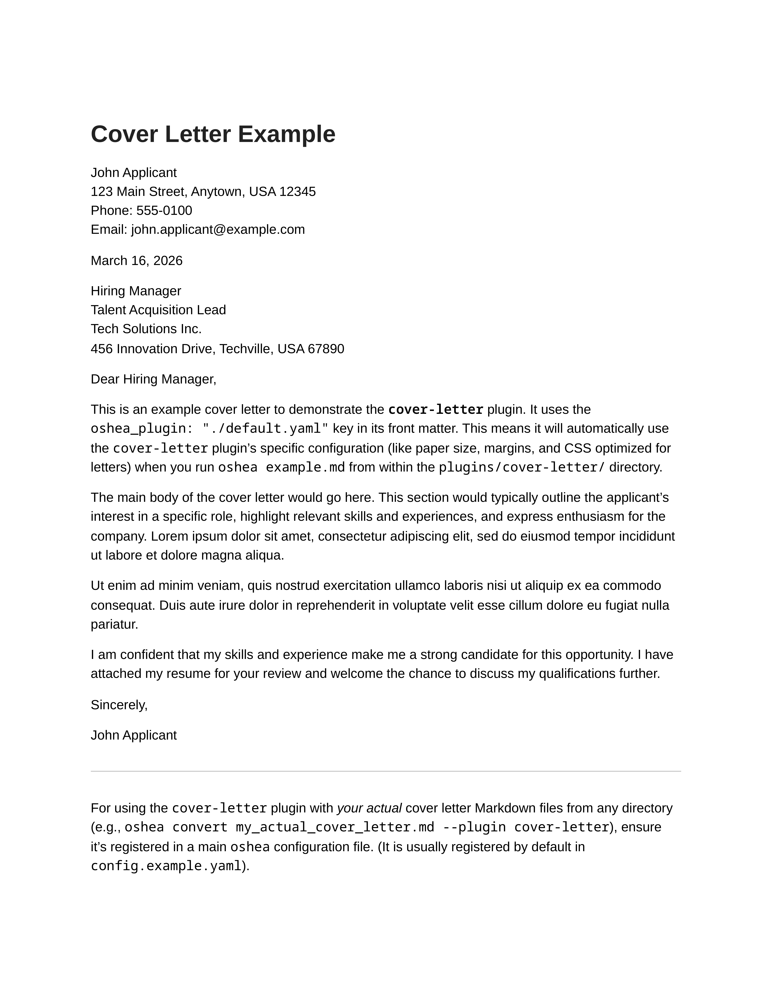

# Cover Letter Plugin (`cover-letter`)

  <table>
    <tr>
      <td align="center">
        
         <strong>Cover Letter Sample</strong>
      </td>
    </tr>
  </table>

This plugin assists in creating professionally formatted cover letters from Markdown.

It relies heavily on YAML front matter to populate common cover letter fields such as sender and recipient contact information, dates, and salutations. The Markdown body is then used for the main content of the letter.
