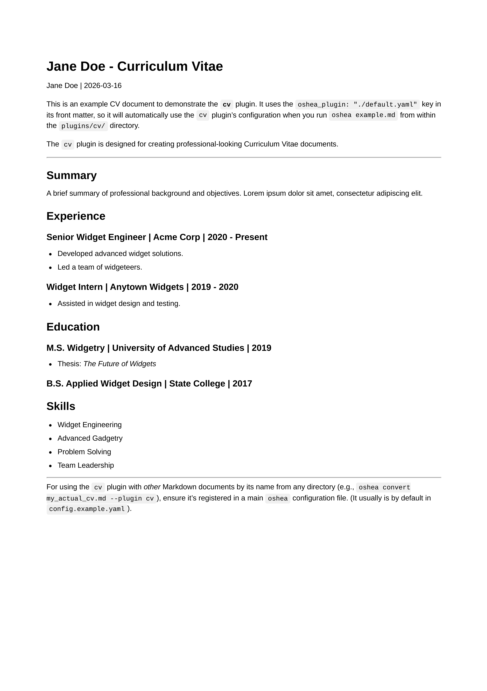

# CV Plugin (`cv`)

  <table>
    <tr>
      <td align="center">
        
         <strong>CV Sample</strong>
      </td>
    </tr>
  </table>

This plugin is designed for converting Markdown files formatted as a Curriculum Vitae (CV) or resume into a professional-looking PDF document.

It uses front matter for metadata/placeholders and applies specific styling for sections like "Experience," "Education," and "Skills."
