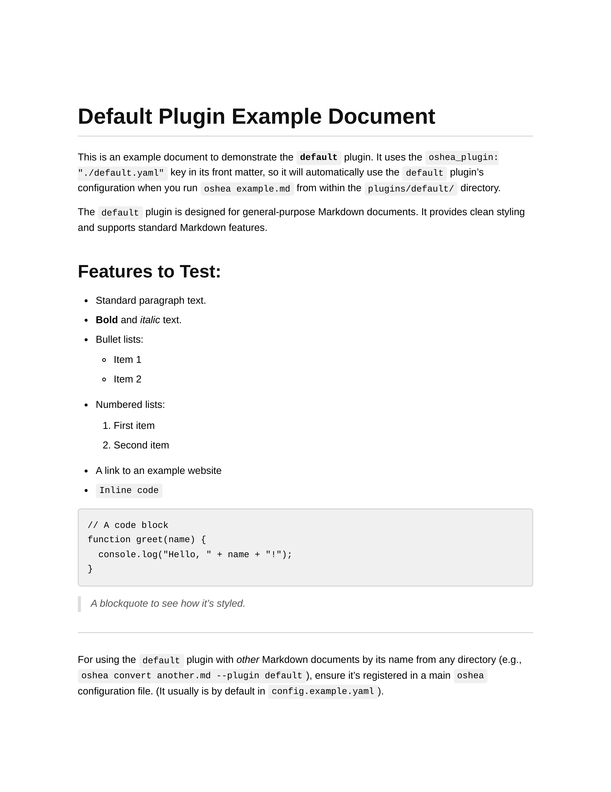

# Default Plugin (`default`)

  <table>
    <tr>
      <td align="center">
        
         <strong>Default Sample</strong>
      </td>
    </tr>
  </table>

This is the standard, general-purpose plugin for `oshea`. It's designed to handle a wide variety of Markdown documents and provides a clean, readable PDF output.

It serves as a good base for understanding basic plugin functionality and can be easily customized via XDG or project-level configuration overrides.
