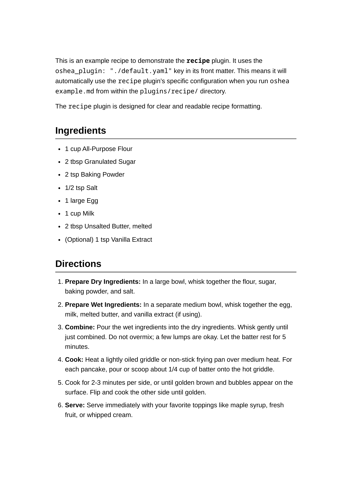

# Recipe Plugin (`recipe`)

  <table>
    <tr>
      <td align="center">
        
         <strong>Recipe Sample (Page 1)</strong>
      </td>
      <td align="center">
        
         <strong>Recipe Sample (Page 2)</strong>
      </td>
    </tr>
  </table>

This plugin is tailored for converting Markdown files formatted as individual recipes into well-structured PDF documents.

It uses front matter for metadata/placeholders and applies specific styling to make ingredients, directions, and other recipe elements clear and easy to follow.
